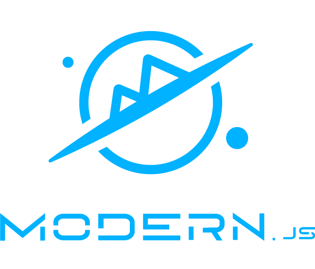

  

<h1 align="center">Modern.js</h1>

  Inspire creativity in modern web development.

  
  
  

[English](./README.md) | 简体中文

## 介绍

Modern.js 框架是一个基于 React 的渐进式 Web 开发框架。在字节跳动内部，我们将 Modern.js 封装为上层框架，并支撑了数千个 Web 应用的研发。

在开发 React 应用过程中，开发者通常需要去为某些功能去设计实现方案，或是使用其他的库、框架来解决这些问题。Modern.js 支持 React 应用所需要的所有配置和工具，并内置额外的功能和优化。开发者可以使用 React 构建应用的 UI，然后逐步采用 Modern.js 的功能来解决常见的应用需求，如路由、数据获取、状态管理等。

## 快速上手

参考 [快速上手](https://modernjs.dev/zh/guides/get-started/quick-start)。

## 生态

Modern.js 生态提供了以下解决方案和底层库：

- 🦀 [Rspack](https://github.com/web-infra-dev/rspack)：基于 Rust 的高性能模块打包工具。
- 🐬 [Rsbuild](https://github.com/web-infra-dev/rsbuild)：基于 Rspack 的 Web 构建工具。
- 🐹 [Rspress](https://github.com/web-infra-dev/rspress)：基于 Rspack 的静态站点生成器。
- 🦄 [Rslib](https://github.com/web-infra-dev/rslib)：基于 Rspack 的 Library 开发工具。

## Benchmark

我们通过 [Modern.js Benchmark](https://web-infra-qos.netlify.app/) 来观测核心指标的变化情况，比如 bundle size、compile speed 和 install size。

## Roadmap

请参阅 [Modern.js Roadmap](https://github.com/web-infra-dev/modern.js/issues/4741)。我们将定期更新 Roadmap 的内容。

## 示例

Modern.js 提供了一系列开箱即用的示例项目，你可以在 [modern-js-examples](https://github.com/web-infra-dev/modern-js-examples) 仓库中找到并使用它们。

## 参与贡献

> 欢迎参与 Modern.js 贡献！

请阅读 [贡献指南](https://github.com/web-infra-dev/modern.js/blob/main/CONTRIBUTING.md) 来共同参与 Modern.js 的建设。

### 行为准则

本仓库采纳了字节跳动的开源项目行为准则。请点击 [行为准则](./CODE_OF_CONDUCT.md) 查看更多的信息。

### 贡献者们

感谢以下伙伴们为 Modern.js 做出的贡献：

## 社区

欢迎加入我们的 [Discord](https://discord.gg/qPCqYg38De) 交流频道！Modern.js 团队和用户都在那里活跃，并且我们一直期待着各种贡献。

你也可以加入[飞书群](https://applink.larkoffice.com/client/chat/chatter/add_by_link?link_token=d21hc667-9403-48a9-ba32-bc1440a80279) 与大家一起交流。

## Credits

Modern.js 中的部分代码是参考社区中的其他项目实现的，比如 [create-react-app](https://github.com/facebook/create-react-app)，[remix](https://github.com/remix-run/remix)，[jest](https://github.com/facebook/jest) 和 [bundle-require](https://github.com/egoist/bundle-require) 等，感谢这些项目：

- `@modern-js/bundle-require`：修改自 [bundle-require](https://github.com/egoist/bundle-require)。
- `@modern-js/plugin`：hook API 的实现参考了 [farrow-pipeline](https://github.com/farrow-js/farrow/tree/master/packages/farrow-pipeline)。
- `@modern-js/plugin-data-loader`：部分实现参考了 [remix](https://github.com/remix-run/remix)。
- `@modern-js/babel-plugin-module-resolver`: 修改自 [babel-plugin-module-resolver](https://github.com/tleunen/babel-plugin-module-resolver)。
- [Netlify](https://www.netlify.com/) 为官网提供托管服务，感谢其优质的服务与对开源的支持

## License

Modern.js 项目基于 [MIT 协议](https://github.com/web-infra-dev/modern.js/blob/main/LICENSE)，请自由地享受和参与开源。

第三方 licenses 列举于 [THIRD-PARTY-LICENSE](./THIRD-PARTY-LICENSE) 中。
