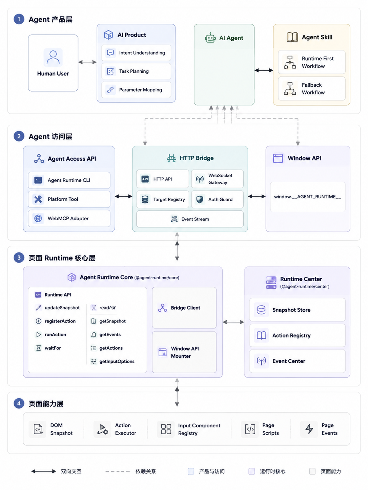

# RFC: Agent Runtime - 面向 AI Agent 的前端运行时能力

## 状态

Draft

## 摘要

本文定义一套面向 AI Agent 的前端运行时能力，统一命名为 **Agent Runtime**。

Agent Runtime 的目标是让前端应用向 Agent 暴露结构化页面状态、运行事件、可等待条件和受控操作 API。Agent 在开发、调试和 oncall 场景中，可以通过这些能力自主观察页面、执行页面声明过的动作，并验证结果，从而减少人的中途介入。

更深层的目标是适应未来应用产品形态的变化：应用不再只面向人直接点击和填写，也需要能被 AI Agent 理解和操控。上层 AI 产品可以接收人的自然语言需求，将其拆解成具体动作和参数，再通过应用暴露的结构化运行时能力完成操作。Agent Runtime 是让前端应用具备这种 Agent 可操作性的基础能力。

核心思路：

- 提供一个通用 `@agent-runtime/core`，维护页面级 Runtime Center。
- Modern.js、MF、Garfish、Goofy 和业务代码把各自掌握的信息写入 Agent Runtime。
- Agent 通过 snapshot、events、actions、waitFor 等 API 理解和操作页面。
- Window API 是页面内最小出口。
- HTTP Bridge 是页面外访问通道，CLI 是 Bridge 的命令行客户端。
- Skill 负责告诉 Agent 如何在任务中使用这些能力。

最终希望让 AI coding 从：

```txt
Agent 修改代码
人盯着页面
人告诉 Agent 哪里不对
Agent 再尝试修复
```

逐步变成：

```txt
Agent 修改代码
Agent 启动页面
Agent 读取运行态
Agent 执行动作
Agent 等待结果
Agent 用证据验证
Agent 自主继续修复
```

## 背景

当前 AI coding 在前端开发里经常卡在“实现后验证”这一步。

Agent 可以修改代码、启动项目、打开页面，但它理解页面运行状态时，仍然主要依赖外部现象：

- 页面 UI 是否看起来正常；
- DOM 里有没有某个元素；
- console 有没有报错；
- network 是否安静；
- 点击后页面有没有变化；
- 人是否告诉它“现在不对”。

这些方式能提供线索，但不稳定，也很依赖人的中途介入。

同样是页面没有按预期工作，真实原因可能分布在完全不同的层：

| 问题层级 | 例子 |
| --- | --- |
| route | basename 错误、route 没匹配、跳转后空白 |
| loader | loader pending、loader error、redirect 不符合预期 |
| render | root 没挂载、hydration 异常、route component 报错 |
| MF remote | manifest / remoteEntry 加载失败 |
| MF expose | expose 解析失败、远程组件不可用 |
| MF shared | React 多实例、shared 版本冲突、invalid hook call |
| chunk / asset | async chunk 404、uniqueName 冲突、资源复用错误 |
| Garfish | 子应用 entry、provider、mount 失败 |
| deploy | consumer / producer 版本错配、资源来自错误 release |
| business | 框架都成功了，但业务数据还没 ready |

如果 Agent 只能看页面外部现象，就很难稳定进入真正的自动循环。

## 长期产品形态：应用需要面向 Agent 可操作

今天大多数前端应用默认只面向人设计。页面通过按钮、表单、列表、弹窗和提示文案，把能力暴露给人；人理解页面状态后，再决定点击哪里、填写什么、等待什么结果。

AI Agent 进入应用之后，产品形态会发生变化。人不一定直接操作页面，而是向上层 AI 产品描述自己的需求，例如“帮我检查这个订单是否异常”、“把这个项目切到灰度环境”、“重新加载失败的远程模块”。上层 AI 产品负责理解意图、拆解步骤、补齐参数，再调用具体应用暴露的能力完成任务。

这意味着应用除了 UI 之外，还需要提供一层面向 Agent 的操作面：

| 面向对象 | 主要入口 | 应用需要提供什么 |
| --- | --- | --- |
| 人 | UI、文案、交互、反馈 | 可读、可点、可填写、可理解 |
| Agent | snapshot、events、actions、waitFor、input options | 可查询、可执行、可等待、可验证 |

Agent Runtime 的 API 正是为这层操作面设计的。

它不是让 Agent 模拟人去点击 DOM，也不是把页面 UI 简单包装成自动化脚本，而是让应用把关键运行时语义直接暴露出来：

- 当前页面是什么状态；
- 当前有哪些可执行动作；
- 每个动作需要哪些参数；
- 参数有哪些合法选项；
- 执行动作后应该等待什么状态；
- 执行结果是否真的成功；
- 如果失败，问题落在哪一层。

因此，Agent Runtime 的长期价值不是“多一个调试接口”，而是让应用具备 Agent 可操作性。未来上层 AI 产品可以基于这层能力，把人的自然语言需求转换成稳定、可验证的应用操作。

## 目标

Agent Runtime 的目标是：

> 让前端应用具备对 Agent 友好的运行时能力，使 Agent 能够读取状态、等待变化、执行声明动作并验证结果。

本 RFC 目标包括：

- 让前端应用在 UI 之外，提供一层面向 Agent 的结构化操作面。
- 支持上层 AI 产品把人的自然语言需求转换成具体 action、参数和验证条件。
- 定义 Agent Runtime 的产品边界和核心概念。
- 定义页面级 Runtime Center、Snapshot、Event Log、Action Registry。
- 定义第一版 Runtime API。
- 定义 Modern.js、MF、Goofy 和业务代码的接入方式。
- 定义 Window API、HTTP Bridge、CLI、Skill 的职责边界。
- 定义第一期能力范围和后续三期规划。

## 边界

Agent Runtime 不做：

- 不做 WebMCP 的竞争协议；
- 不做通用浏览器自动化框架；
- 不负责理解人的自然语言需求，也不负责上层任务规划；
- 不做任意 DOM 操作系统；
- 不做生产监控或 APM；
- 不自动猜业务成功标准；
- 不让 Agent 执行未声明的危险动作；
- 第一期不做跨 tab、跨 iframe、跨 worker、多 Runtime Center 聚合；
- 不要求所有生产者强依赖同一个 SDK 包版本。

## 术语

| 名称 | 含义 |
| --- | --- |
| Agent Runtime | 产品能力名称，表示面向 Agent 的前端运行时能力 |
| Agent Runtime SDK | 前端应用接入 Agent Runtime 的 SDK |
| Runtime Center | 页面内状态中心，负责维护 snapshot、events、actions |
| Runtime Client | Modern.js、MF、业务代码等写入方 |
| Snapshot | 页面当前状态 |
| Event Log | 页面历史变化过程 |
| Action Registry | 页面声明给 Agent 的可执行动作 |
| Window API | `window.__AGENT_RUNTIME__`，页面内最小访问出口 |
| HTTP Bridge | 页面外访问 Agent Runtime 的本地服务 |
| CLI | HTTP Bridge 的命令行客户端和辅助工具 |
| Skill | 教 Agent 如何使用 Agent Runtime 的任务说明或能力包 |

## 产品形态

Agent Runtime 是一套前端运行时 SDK。

它由三层组成：

```txt
采集层
Modern.js / MF / Garfish / Goofy / 业务代码
        ↓
核心运行时
Runtime Center / Snapshot / Events / Ready / Blockers / Actions
        ↓
暴露层
Window API / Bridge Server / CLI / WebMCP / 平台原生能力
```

稳定的是运行时语义：

- `snapshot`：页面当前状态；
- `events`：页面历史过程；
- `ready`：某个页面、路由、组件或业务目标是否可用；
- `blockers`：当前为什么还不能认为 ready；
- `actions`：页面声明给 Agent 的安全动作；
- `evidence`：Agent 判断结果成立的证据。

可替换的是访问方式：

- 现在可以先用 `window.__AGENT_RUNTIME__` 暴露；
- 内部平台可以通过自己的 bridge 访问；
- HTTP Bridge 可以给 CLI 和 Agent 使用；
- 后续 WebMCP 成熟后，可以新增 WebMCP adapter；
- 移动端容器或平台原生能力也可以提供自己的 adapter。

关键原则：

> Runtime Center 不关心自己被哪种方式访问。WebMCP、CLI、Bridge Server、Window API 都只是 transport，不是核心协议。

## 和 WebMCP 的关系

WebMCP 可以作为未来的一个重要出口，但不是 Agent Runtime 的替代品。

WebMCP 更像是：

```txt
Agent 如何发现和调用页面能力
```

Agent Runtime 要解决的是：

```txt
前端应用如何产出 Agent 需要的页面状态、运行事件、ready 条件、blockers 和 actions
```

所以更合理的关系是：

```txt
Modern.js / MF / Garfish / Goofy / 业务代码
        ↓
Agent Runtime
        ↓
WebMCP adapter / CLI / Bridge / Window API
        ↓
Agent
```

后续如果 WebMCP 成熟，可以把 Agent Runtime 的能力注册成 WebMCP tools：

- `agentRuntime.getSnapshot`
- `agentRuntime.getEvents`
- `agentRuntime.getActions`
- `agentRuntime.waitFor`
- `agentRuntime.runAction`

这样不是被 WebMCP 替代，而是把 WebMCP 作为标准出口。

## 总体架构



核心关系：

```txt
Modern.js / MF / Garfish / Goofy / 业务代码
        ↓
Runtime Client
        ↓
页面级 Runtime Center
        ↓
Window API / Bridge Client
        ↓
HTTP Bridge
        ↓
CLI / Skill / Agent / 平台
```

一个页面内应该有一个主 Runtime Center，负责聚合：

- 当前 snapshot；
- 历史 events；
- ready 状态；
- blockers；
- actions；
- errors。

写入方可以有多个：

- Modern.js Runtime Client；
- MF Runtime Client；
- Garfish Runtime Client；
- Goofy Runtime Client；
- 业务 Runtime Client；
- 其他框架或自定义 runtime 的 Runtime Client。

这些 client 可以来自不同包、不同版本，但最终写入同一个页面级 Runtime Center。

第一期不做多个 Runtime Center 的自动合并。多中心会带来 snapshot 合并、事件排序、action 冲突、ready 归并等复杂问题。

## 接入和访问方式

Agent Runtime 的接入和访问需要分开看：

```txt
页面如何接入 Agent Runtime
页面外的 Agent 如何访问 Agent Runtime
```

页面内接入依赖 SDK。页面外访问依赖 Window API、HTTP Bridge、CLI 或未来的 WebMCP adapter。

### 基础 SDK

第一版只提供一个基础包：

```txt
@agent-runtime/core
```

Modern.js、MF 和业务代码都依赖这个包：

```txt
Modern.js 内置接入 -> @agent-runtime/core
MF 内置接入        -> @agent-runtime/core
业务手动接入      -> @agent-runtime/core
```

第一期不单独提供：

```txt
@agent-runtime/modern-js
@agent-runtime/module-federation
@agent-runtime/react
```

原因是：

- Modern.js 和 MF 可以直接在各自实现里内置 Agent Runtime；
- React tree 暂时不是判断业务 ready 的核心依据；
- 过早拆包会增加理解成本和维护成本。

### Window API

Window API 是最小访问出口：

```ts
window.__AGENT_RUNTIME__
```

它适合：

- 本地调试；
- Agent 通过浏览器上下文直接读取；
- 没有 HTTP Bridge 时作为兜底；
- 验证 SDK 是否正常工作。

Window API 不负责跨进程通信。页面外的 Agent 如果要稳定访问页面运行态，仍然需要 HTTP Bridge。

### HTTP Bridge

HTTP Bridge 是本地服务，不是 SDK 本体。它负责把页面里的 Agent Runtime 暴露给页面外的 Agent、CLI 或平台。

核心链路：

```txt
页面 Agent Runtime
        ↓ WebSocket 主动连接
本地 HTTP Bridge
        ↑ HTTP API
Agent / CLI / 平台
```

页面需要主动连接 Bridge，因为浏览器页面不能自己启动 HTTP 服务，页面外的 Agent 也不能直接请求某个页面实例。

第一版 HTTP Bridge 可以提供：

```txt
GET  /targets
GET  /targets/:id/snapshot
GET  /targets/:id/events
GET  /targets/:id/actions
GET  /targets/:id/actions/:name/options
POST /targets/:id/actions/:name/run
POST /targets/:id/wait-for
GET  /targets/:id/events/stream
```

其中：

- `targets` 表示当前连接到 Bridge 的页面；
- `snapshot` 表示页面当前状态；
- `events` 表示页面历史变化；
- `actions` 表示页面声明的可执行动作；
- `options` 表示动态参数选项；
- `run` 表示执行页面声明过的 action；
- `wait-for` 表示等待页面状态变化；
- `events/stream` 表示持续监听事件。

页面里的 Agent Runtime 仍然是事实来源。Bridge 可以缓存最近的 snapshot 和 events，但不能成为主状态源。页面断开后，Bridge 可以返回最后一次看到的状态，但必须标记为 disconnected。

### Bridge 开启方式

Bridge 连接需要三层控制：

```txt
构建期注入：决定页面代码里有没有 bridge client
运行期配置：决定这次页面要不要连接 bridge
Bridge 鉴权：决定连上来的页面能不能被接受
```

Modern.js 可以提供这样的配置：

```ts
export default defineConfig({
  agentRuntime: {
    enabled: true,
    bridge: {
      enabled: 'dev',
    },
  },
});
```

`bridge.enabled` 的第一版类型可以是：

```ts
type BridgeEnabled = boolean | 'dev' | 'manual';
```

含义：

| 值 | 含义 |
| --- | --- |
| `true` | 总是尝试连接 Bridge |
| `false` | 不连接 Bridge |
| `'dev'` | 仅 dev 环境自动连接 |
| `'manual'` | 注入 bridge client，但只有 query、localStorage 或服务端配置显式打开时才连接 |

推荐默认策略：

| 场景 | 策略 |
| --- | --- |
| 本地 dev | `bridge.enabled = 'dev'` |
| staging / oncall | `bridge.enabled = 'manual'` |
| production | `bridge.enabled = false` |

Bridge Server 还需要校验 token、origin、app name 和 runtime version。页面允许连接不代表 Bridge 一定接受。

### 构建插件

通用 Rspack / Webpack 构建插件应该和 HTTP Bridge 一起提供基础版本，但它不是 Modern.js 用户的主入口。

更合理的定位是：

```txt
@agent-runtime/core
Modern.js 内置接入
通用 Rspack / Webpack 构建插件
```

Modern.js 用户不应该手动配置 `AgentRuntimeWebpackPlugin` 或 `AgentRuntimeRspackPlugin`。Modern.js 只暴露框架配置，内部复用通用注入逻辑。

通用构建插件主要服务两个场景：

- 非 Modern.js 项目接入 Agent Runtime；
- Modern.js 内部复用同一套初始化和 bridge client 注入逻辑。

### CLI

CLI 主要配合 HTTP Bridge 使用。

没有 HTTP Bridge 时，CLI 只能做辅助能力：

- 启动 Bridge；
- 检查 Bridge 状态；
- 打印接入配置；
- 打开页面；
- 读取项目里的静态配置。

它不能稳定完成核心运行态能力：

- 读取页面 runtime 状态；
- 获取 actions；
- 执行 action；
- 等待 ready；
- 读取 runtime events。

因此第一版 CLI 的定位是：

```txt
CLI = Bridge Server 管理器 + Bridge HTTP API 客户端 + 接入辅助工具
```

CLI 可以提供：

```bash
agent-runtime bridge
agent-runtime status
agent-runtime targets
agent-runtime snapshot --target <target-id>
agent-runtime events --target <target-id>
agent-runtime actions --target <target-id>
agent-runtime run-action --target <target-id> <action-name>
agent-runtime wait-for --target <target-id> <id> <status>
```

### Skill

Agent 真正知道如何使用 Agent Runtime，主要依赖 Skill 或平台工具说明。

推荐链路：

```txt
Agent Skill
  ↓
CLI 或 HTTP API
  ↓
HTTP Bridge
  ↓
页面 Agent Runtime
```

Skill 负责告诉 Agent：

- 优先检查是否存在 Agent Runtime；
- 如何连接 Bridge；
- 如何读取 snapshot、events 和 actions；
- 如何执行 action；
- 如何等待目标状态；
- 如何用结果验证问题；
- 没有 Agent Runtime 时再 fallback 到 UI、console、network。

## 数据模型

Agent Runtime 内部先收敛为三类核心数据：

```txt
Snapshot
Event Log
Action Registry
```

### Snapshot

Snapshot 表示页面当前仍然有效的运行态，不保存完整历史。

```ts
type RuntimeSnapshot = {
  items: RuntimeSnapshotItem[];
  relations: RuntimeSnapshotRelation[];
  latestEventId: number;
};
```

`items` 表示当前页面里的运行时对象：

```ts
type RuntimeSnapshotItem = {
  id: string;
  type:
    | 'app'
    | 'route'
    | 'loader'
    | 'component'
    | 'form'
    | 'field'
    | 'remote'
    | 'expose'
    | 'shared'
    | 'sub-app'
    | 'business'
    | 'custom';
  status:
    | 'idle'
    | 'loading'
    | 'pending'
    | 'success'
    | 'error'
    | 'ready'
    | 'blocked'
    | 'inactive';
  source: string;
  label?: string;
  data?: unknown;
  error?: RuntimeError;
  updatedAt: number;
};
```

`relations` 表示对象关系：

```ts
type RuntimeSnapshotRelation = {
  from: string;
  to: string;
  type:
    | 'contains'
    | 'depends-on'
    | 'loads'
    | 'renders'
    | 'provides'
    | 'shares'
    | 'custom';
  relation?: string;
  label?: string;
  data?: unknown;
};
```

内置 relation type 的默认含义：

| type | 含义 |
| --- | --- |
| `contains` | 包含关系，例如 app contains route |
| `depends-on` | 依赖关系，例如 route depends-on loader |
| `loads` | 加载关系，例如 route loads MF remote |
| `renders` | 渲染关系，例如 expose renders component |
| `provides` | 提供关系，例如 remote provides expose |
| `shares` | shared 依赖关系，例如 MF shares react |
| `custom` | 业务自定义关系 |

`custom` 用于业务特殊关系，但需要配合 `relation` 或 `label` 使用：

```ts
{
  from: 'field:province',
  to: 'field:city',
  type: 'custom',
  relation: 'controls-options',
  label: 'Province controls city options',
}
```

不建议第一版直接允许任意 string type。稳定的内置类型更利于 Agent 推理，业务扩展通过 `custom + relation` 表达。

### Event Log

Event 记录 Snapshot 的变化过程。

```ts
type RuntimeEvent = {
  id: number;
  type: string;
  source: string;
  timestamp: number;
  itemId?: string;
  relation?: RuntimeSnapshotRelation;
  status?: RuntimeSnapshotItem['status'];
  data?: unknown;
  error?: RuntimeError;
};
```

事件由 Runtime Center 自动记录，不对外提供公开 `emit`。

自动事件包括：

- `snapshot.updated`
- `relation.updated`
- `action.registered`
- `action.unregistered`
- `action.started`
- `action.success`
- `action.error`
- `wait.timeout`

这样使用方不需要同时维护 snapshot 和 events，避免双写不一致。

### Action Registry

Action 是页面声明给 Agent 的可调用能力。Agent 不应该随便操作 DOM，而是调用页面声明过的 action。

第一版 action 先采用纯 action 声明，不做 DOM 自动识别、UI steps 或通用表单自动填写。

```ts
type RuntimeAction = {
  name: string;
  description?: string;
  params?: RuntimeActionParam[];
  getInputOptions?: RuntimeInputOptionsProvider;
  expect?: RuntimeCondition | RuntimeCondition[];
  enabled?: boolean;
  blockedBy?: RuntimeCondition[];
  risk?: 'safe' | 'state-changing' | 'destructive' | 'sensitive';
  handler: RuntimeActionHandler;
};
```

`name` 和 `handler` 是核心。`params`、`getInputOptions`、`expect` 用于帮助 Agent 更稳定地传参和验证结果。

```ts
type RuntimeActionParam = {
  name: string;
  type: 'string' | 'number' | 'boolean' | 'option';
  required?: boolean;
  description?: string;
  dependsOn?: string[];
};

type RuntimeInputOptionsProvider = (
  inputName: string,
  currentPayload?: Record<string, unknown>,
) => Promise<RuntimeOption[]> | RuntimeOption[];

type RuntimeOption = {
  label: string;
  value: string | number | boolean;
  description?: string;
};

type RuntimeCondition = {
  id: string;
  status: RuntimeSnapshotItem['status'];
};
```

## 第一版公开 API

公开 API 分成写入侧和 Agent 读取 / 执行侧。

写入侧：

```ts
runtime.updateSnapshot(input);
runtime.registerAction(action);
runtime.unregisterAction(actionName);
runtime.runAction(actionName, payload?);
```

其中：

- `updateSnapshot` 更新当前页面状态；
- `registerAction` 注册页面声明给 Agent 的可调用能力；
- `unregisterAction` 注销 action；
- `runAction` 执行 action，既可以给 Agent 用，也可以给本地自测用。

`updateSnapshot` 的第一版形态：

```ts
type UpdateSnapshotInput = {
  id: string;
  status: RuntimeStatus;
  type?: RuntimeObjectType;
  source?: string;
  label?: string;
  data?: unknown;
  error?: RuntimeError;
  relations?: RuntimeRelationInput[];
};
```

必填字段只有 `id` 和 `status`。`type` 默认是 `business`，`source` 默认是 `business`。

业务用户可以直接写：

```ts
runtime.updateSnapshot({
  id: 'user-profile',
  status: 'ready',
});
```

框架和 MF 这类接入方建议显式传 `type` 和 `source`：

```ts
runtime.updateSnapshot({
  id: 'route:/home',
  type: 'route',
  source: 'modern-js',
  status: 'success',
});
```

Agent 读取 / 执行侧 API：

```ts
getSnapshot();
getEvents(filter?);
getActions();
getInputOptions(actionName, inputName, currentPayload?);
runAction(actionName, payload?);
waitFor(condition, options?);
```

其中：

- `getSnapshot` 读取当前状态；
- `getEvents` 读取历史变化；
- `getActions` 读取页面声明过的动作；
- `getInputOptions` 读取动态参数选项；
- `runAction` 执行动作；
- `waitFor` 等待目标状态。

第一版不做：

- DOM 自动识别；
- UI steps；
- 通用表单自动填写；
- workflow engine；
- 多 Runtime Center 聚合；
- 从 DOM 自动推断 params。

## Modern.js 接入

Modern.js 负责把框架自己已经知道的信息写入 Agent Runtime。业务用户不应该为了基础路由状态手动埋点。

第一期 Modern.js 需要记录：

| 记录数据 | 解决的问题 |
| --- | --- |
| app name、mode、base、runtime version | Agent 知道当前跑的是哪个 Modern.js 应用 |
| root mounted / hydration 状态 | 判断根节点没挂载、hydration 异常、白屏 |
| 当前 location、basename、matched routes | 判断路由有没有匹配错、basename 是否错误 |
| navigation 状态 | 判断页面是否还在跳转中 |
| redirect 信息 | 判断是否被 loader 或路由逻辑重定向 |
| route loader start / success / error / redirect | 判断页面卡住是 loader 问题还是渲染问题 |
| route component mounted / error | 判断路由匹配后组件是否真的渲染成功 |
| framework error boundary 信息 | 判断是不是 React render 阶段报错 |

Modern.js 可以内置常用安全 action：

| action | 用途 |
| --- | --- |
| `navigate` | 让 Agent 走框架路由跳转 |
| `retryLoader` | 让 Agent 重试当前路由数据加载 |

示例：

```ts
router.subscribe(state => {
  runtime.updateSnapshot({
    id: `route:${state.location.pathname}`,
    type: 'route',
    source: 'modern-js',
    status: state.navigation.state === 'idle' ? 'success' : 'loading',
    data: {
      location: state.location.pathname,
      matches: state.matches.map(match => match.route.id),
    },
  });
});
```

loader 由框架包装已有 loader，不自动创建新的 loader：

```ts
function wrapLoader(routeId: string, loader: LoaderFunction) {
  return async args => {
    runtime.updateSnapshot({
      id: `loader:${routeId}`,
      type: 'loader',
      source: 'modern-js',
      status: 'loading',
      relations: [
        {
          type: 'depends-on',
          from: `route:${routeId}`,
        },
      ],
    });

    try {
      const result = await loader(args);

      runtime.updateSnapshot({
        id: `loader:${routeId}`,
        type: 'loader',
        source: 'modern-js',
        status: 'success',
        data: isRedirect(result) ? { redirect: true } : undefined,
      });

      return result;
    } catch (error) {
      runtime.updateSnapshot({
        id: `loader:${routeId}`,
        type: 'loader',
        source: 'modern-js',
        status: 'error',
        error,
      });
      throw error;
    }
  };
}
```

## MF 接入

MF 自身状态优先复用 MF Observability Plugin。Agent Runtime 不重复实现一套 MF 加载追踪，而是在 MF 侧提供一个 Agent Runtime MF Adapter：

```txt
MF Observability Plugin
        ↓
Agent Runtime MF Adapter
        ↓
Agent Runtime
```

这个 Adapter 负责把 MF hooks 和 Observability report 转成 Agent Runtime 的 snapshot、relations 和 events。

第一版接入方式分三类：

- 使用 MF 构建插件时，由构建插件自动注入 Agent Runtime MF Adapter，并自动标注当前应用是哪个 MF consumer；
- 使用 MF runtime API 时，用户注册 `agentRuntimeMFPlugin()`，由 runtime plugin 从 MF instance 里读取 consumer、remotes、shared 和加载过程；
- 非标准封装场景，提供 `registerMFConsumer()` helper，让用户显式声明当前 consumer。

`registerMFConsumer()` 不是新的底层核心 API，只是 MF Adapter 的便捷入口。它内部仍然写入 Agent Runtime snapshot。

第一期 MF 需要记录：

| 记录数据 | 解决的问题 |
| --- | --- |
| 当前 consumer name / role | Agent 知道当前应用是谁在消费 MF |
| remotes 列表 | Agent 知道当前页面可能加载哪些生产者 |
| remote manifest / remoteEntry URL | 判断远程入口是否错误、404、跨环境 |
| remote loading / success / error | 判断生产者是否加载成功 |
| expose name / load status | 判断具体暴露模块是否解析成功 |
| shared dependency provider / version / singleton | 判断 React 多实例、shared 冲突、版本不一致 |
| uniqueName、build id | 判断 chunk 复用、运行时冲突、构建产物冲突 |
| chunk / asset loading trace | 判断 async chunk 404、publicPath 错、资源错位 |
| loadedBefore / reused | 判断是否复用了之前 consumer 加载过的模块 |

构建插件接入时，消费者身份可以从 MF 配置自动获得：

```ts
pluginModuleFederation({
  name: 'federation_consumer',
  remotes: {
    cloudConsoleProvider:
      'cloudConsoleProvider@http://localhost:4351/mf-manifest.json',
  },
  runtimePlugins: [
    agentRuntimeMFPlugin(),
    observabilityPlugin(),
  ],
});
```

Observability report 到 Agent Runtime 的转换规则：

| MF 信息 | Agent Runtime 表达 |
| --- | --- |
| consumer / instance | consumer 写成 `type: 'app'`，instance 细节写入 `data` |
| remote loading / success / pending | `type: 'remote'` + 对应 `status` |
| remote failed | `type: 'remote'` + `status: 'error'` |
| remote recovered | `type: 'remote'` + `status: 'success'`，并在 `data` 里记录 recovered |
| expose loaded / failed | `type: 'expose'` + `status: 'success'` 或 `status: 'error'` + `provides` relation |
| shared provider / selected version / available versions | `type: 'shared'` + `shares` relation |
| manifest / remoteEntry / assets | 写入 `data` |
| loading trace events | 自动进入 `events` |
| loadedBefore / reused | 写入 `data`，用于判断是否复用了其他 consumer 的加载结果 |

## Goofy 接入

Goofy 在第一期主要提供部署上下文。它不一定进入页面运行时主链路，但应该让 Agent 能把页面运行态和部署版本关联起来。

第一期 Goofy 需要记录或可查询：

| 记录数据 | 解决的问题 |
| --- | --- |
| app id / app name | Agent 知道页面对应哪个部署应用 |
| env / region / cluster | 判断是不是访问错环境、错区域 |
| release id / deployment id | 判断当前页面来自哪次发布 |
| git commit / branch / build id | 把页面问题关联到源码版本 |
| artifact id / static asset base URL | 判断 JS/CSS/chunk 来自哪个构建产物 |
| deploy status | 判断页面问题是否来自发布未完成或失败 |
| rollback / previous release 信息 | 判断是不是新版本引入的问题 |
| build logs / deploy logs 链接 | 给 Agent 定位构建或部署失败证据 |
| MF manifest / remoteEntry 对应 release | 判断 consumer 和 producer 是否版本错配 |
| sourcemap 是否存在 | 为第二期源码定位做准备 |

第一期 Goofy 更适合做只读上下文提供者，不建议提供发布、回滚等写操作 action。

## 业务代码接入

业务只补充框架无法判断的信息。

例如业务组件加载完关键数据后，声明状态：

```tsx
export function OrderDetailPage() {
  const { data, loading, error } = useOrderDetail();

  runtime.updateSnapshot({
    id: 'order-detail-page',
    status: error ? 'error' : !loading && data ? 'ready' : 'pending',
    data: {
      orderId: data?.id,
    },
    error,
  });

  if (loading) {
    return <Loading />;
  }

  if (error) {
    return <ErrorView error={error} />;
  }

  return <OrderDetail data={data} />;
}
```

用户也可以声明 Agent 能安全执行的动作：

```tsx
export function OrderDetailPage() {
  const { refetch } = useOrderDetail();

  runtime.registerAction({
    name: 'retryOrderDetail',
    description: 'Retry order detail request.',
    risk: 'safe',
    handler: () => refetch(),
  });

  return <OrderDetail />;
}
```

用户侧目标不是“多写埋点”，而是只在业务成功标准和安全动作上补充框架无法自动知道的信息。

## 能解决的问题

结合现有 demo，第一期可以解决这些问题：

| 问题类型 | 对应 demo | Agent Runtime 帮助 |
| --- | --- | --- |
| 路由路径或 basename 错误 | `account-flow` | 直接看到 location、basename、matched routes、route component 状态 |
| Router 嵌套或渲染异常 | `workspace-shell` | 看到 route 已匹配，但 route component 或 render error 异常 |
| loader / redirect 状态不清楚 | `cloud-console` | 看到 loader start / success / error / redirect，以及最终 route 状态 |
| MF shared 冲突 | `order-adapter` | 看到 React shared 的 provider、version、singleton、来源 |
| MF remote / expose 加载失败 | `creative-hub` | 看到 consumer、remote、manifest、expose、shared 的加载状态 |
| async chunk / uniqueName / 资源复用问题 | `rivendell-workbench` | 看到 chunk / asset trace、uniqueName、build id、loadedBefore / reused |
| Garfish 子应用 mount 失败 | `creative-hub`、`rivendell-workbench` | 看到 sub-app load / mount / error 状态，并能区分 MF、Garfish 和业务 ready |
| 部署版本错配 | MF / chunk 类 demo | 通过 Goofy 看到 release、commit、artifact、asset base，并关联 consumer / producer 版本 |

第一期完成后，Agent 至少能把问题归因到：

```txt
route / loader / render / MF remote / MF shared / Garfish mount / chunk asset / deployment version
```

## 使用流程

Agent 打开页面后，优先读取 Agent Runtime：

```ts
const snapshot = await agentRuntime.getSnapshot();
const events = await agentRuntime.getEvents();
const actions = await agentRuntime.getActions();
```

如果页面声明了安全动作，Agent 可以执行：

```ts
await agentRuntime.runAction('cloud-console.run-client-fallback');
```

执行后再读取：

```ts
const nextSnapshot = await agentRuntime.getSnapshot();
const nextEvents = await agentRuntime.getEvents({ since: snapshot.latestEventId });
```

Agent 应该用前后状态和事件作为验证证据，而不是只说“页面看起来正常”。

第一期可以先用 `cloud-console` 这类 demo 验证：

1. 页面初始停在 `/`；
2. Agent Runtime snapshot 显示 route pending、loader pending、business pending；
3. Agent 读取 actions，发现可执行 fallback action；
4. Agent 执行 action；
5. 页面进入 `/home`；
6. snapshot 更新为 route success、loader success、business ready；
7. events 记录完整变化过程。

这能验证 Agent Runtime 是否真的帮助 Agent 完成：

```txt
观察 → 操作 → 验证
```

## 阶段规划

整体规划收敛为三期。

### 第一期：Agent Runtime 最小可用闭环

目标：

> Agent 能在 demo 和本地开发场景里，通过 Agent Runtime 读取状态、执行动作、等待结果，并输出有证据的判断。

第一期需要提供：

| 方向 | 能力 |
| --- | --- |
| Core SDK | `updateSnapshot`、`registerAction`、`unregisterAction`、`runAction`、`waitFor`、`getInputOptions`、`getSnapshot`、`getEvents`、`getActions` |
| Window API | `window.__AGENT_RUNTIME__` |
| HTTP Bridge | 页面主动连接 Bridge；提供 targets、snapshot、events、actions、run-action、wait-for |
| CLI | 启动 Bridge、查看 targets、读取 snapshot / events / actions、执行 action、等待状态 |
| Skill | 告诉 Agent 优先读取 Agent Runtime，没有 runtime 时再 fallback 到 UI、console、network |
| 构建插件 | 提供 Rspack / Webpack 基础版本，用于注入 runtime 初始化和 bridge client；Modern.js 内部可以复用 |
| Modern.js | app/root、route location、basename、match、navigation、redirect、loader、route component、hydration、render error |
| MF | 基于 Observability Plugin 记录 consumer、remote、expose、shared、manifest、remoteEntry、uniqueName、build id、chunk / asset trace、loadedBefore / reused |
| Goofy | app、env、release、commit、branch、artifact、asset base、sourcemap 是否存在 |

### 第二期：编译产物到源码定位

目标：

> Agent 只看到线上或构建后页面，也能结合 Goofy、sourcemap 和 MF 信息，定位到源码文件和行号。

第二期需要打通：

- 根据页面 URL / asset URL 找到 Goofy release；
- 根据 chunk 找到 artifact；
- 根据 artifact 找到 sourcemap；
- 根据 sourcemap 还原源码位置；
- 结合 MF 信息判断问题属于 consumer 还是 producer；
- 结合 expose / shared / chunk trace 定位具体模块。

第二期希望 Agent 输出完整证据链：

```txt
哪个应用
哪个 release
哪个 chunk
哪个 sourcemap
哪个源码文件
哪一行代码
为什么判断是这里
```

### 第三期：生产可用和平台化

目标：

> 让这套能力能安全地用于 staging / oncall / 平台任务，而不只是本地 demo。

第三期需要补齐：

- Bridge 登录态场景打磨；
- token / origin / app / runtime version 校验；
- action 权限控制；
- sensitive / destructive action 默认禁止；
- staging / oncall 手动开启模式；
- 多 target 管理；
- 平台模板集成；
- 标准评测集；
- 效果数据统计；
- WebMCP adapter 或平台原生工具出口。

三期关系可以概括为：

| 阶段 | 重点 |
| --- | --- |
| 第一期 | 最小可用闭环：Core API + Modern.js + MF + Goofy 基础上下文 + Bridge + CLI + Skill + 构建插件 |
| 第二期 | 源码定位：Goofy + sourcemap + MF 信息定位到源码文件和行号 |
| 第三期 | 生产可用：登录态、权限、安全、平台化、评测、标准出口 |

## 待确认问题

- `window.__AGENT_RUNTIME__` 的精确字段和能力协商协议。
- Bridge 的默认端口、token 生成和 token 传递方式。
- staging / oncall 手动开启 Bridge 的具体入口，例如 query、localStorage、服务端配置或平台开关。
- Goofy 到页面 runtime 的上下文注入方式，是构建期注入、运行期查询，还是 Bridge 侧查询。
- sourcemap 定位的权限边界和产物访问方式。
- action 的权限模型，尤其是 `sensitive` 和 `destructive` action 的确认机制。
- 多 target 场景下的默认选择策略。
- WebMCP adapter 的标准出口形态。
