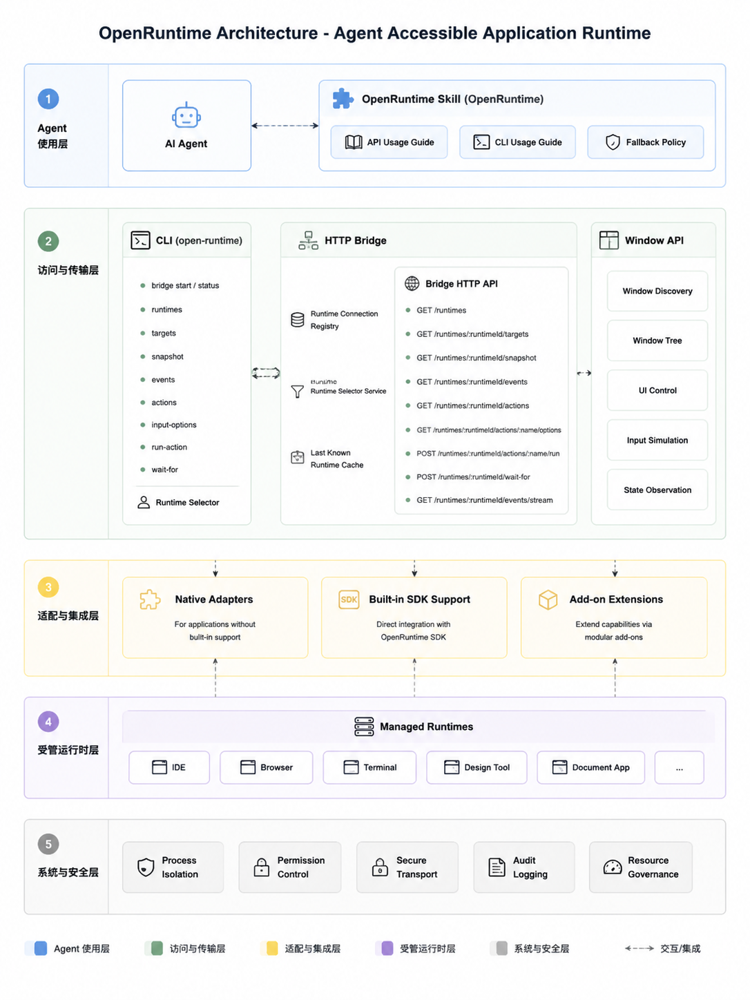

# RFC: OpenRuntime - 面向 Agent 开放应用运行时

## 状态

Draft

## 摘要

OpenRuntime 是一套让应用向 Agent 开放运行时状态、事件和动作的能力，用来提速 AI coding 中的页面验证、问题定位和修复闭环。

这里的 Open 不是强调开源，而是强调“应用把自己的 Runtime 开放给 Agent 访问”。应用通过 OpenRuntime 暴露结构化的 State、Action 和 Event，让 Agent 可以读取状态、等待变化、执行声明动作并验证结果。

## 背景

前端场景里的 Agent 经常卡在“实现后验证”这一步。它可以改代码、启动项目、打开页面，但判断页面是否真的可用时，仍然主要依赖 UI、DOM、console、network 或人的反馈。

这些外部信号不稳定，也很难告诉 Agent 问题具体卡在哪一层。相同的“页面不对”可能来自 route、loader、render、MF remote、shared、Garfish 子应用、chunk asset、部署版本或业务 ready。

OpenRuntime 要解决的是：应用主动把关键运行时语义开放出来，让 Agent 不再只看页面外观，而是能直接读取当前状态、关键变化过程和可执行动作。

## 目标

- 定义 OpenRuntime 的核心语义：targets、snapshot、events、actions、waitFor。
- 定义页面内 Runtime Center 的数据模型和 API。
- 定义页面如何连接本地 Bridge。
- 定义 Agent / CLI 如何读取状态、执行动作和等待结果。
- 定义 Modern.js、Module Federation、Garfish 和业务代码如何接入。
- 通过以上能力，提速 AI coding 中的页面验证、问题定位和修复闭环。

## 非目标

OpenRuntime 第一版不做：

- 不做 WebMCP 的竞争协议。
- 不做通用浏览器自动化框架。
- 不做任意 DOM 操作系统。
- 不自动猜业务成功标准。
- 不让 Agent 执行未声明的危险动作。
- 不默认采集完整 console、network、DOM mutation 或所有调试日志。
- 不做跨 tab、跨 iframe、跨 worker 或多 Runtime Center 聚合。
- 不要求所有生产者强依赖同一个 SDK 包版本。

## 使用示例

### 使用 API

Agent 打开页面后，优先读取 OpenRuntime：

```ts
const snapshot = await openRuntime.getSnapshot();
const actions = await openRuntime.getActions();
```

如果页面声明了安全动作，Agent 可以执行：

```ts
await openRuntime.runAction('cloud-console.run-client-fallback');
```

执行后等待目标状态：

```ts
await openRuntime.waitFor({
  id: 'business:cloud-console.dashboard',
  status: 'ready',
});
```

如果等待失败，再读取相关 events：

```ts
const events = await openRuntime.getEvents({
  since: snapshot.latestEventId,
  targetId: 'business:cloud-console.dashboard',
});
```

### 使用 CLI

Agent 或开发者也可以通过 CLI 访问页面 Runtime：

```bash
open-runtime wait-for --url http://localhost:8080/route-a route:/route-a ready \
  --timeout 10000

open-runtime run-action --url http://localhost:8080/route-a selectRegion \
  --payload '{"province":"zhejiang","city":"hangzhou"}'
```

CLI 通过 HTTP Bridge 找到对应页面 Runtime，再调用同一套 Runtime API。

## 产品形态

| 产物 | 使用方 | 包含内容 |
| --- | --- | --- |
| SDK | 框架、adapter、业务代码 | Runtime Center、写入 API、读取 API、Window API、Modern.js / MF / Garfish 接入、业务 helper |
| CLI | Agent、开发者 | Bridge 管理、Runtime 选择、读取状态、执行 action、waitFor |
| Skill | Agent | 告诉 Agent 什么时候使用 OpenRuntime、如何使用 API / CLI、失败时如何 fallback |

## 架构图



## Runtime Center

每个页面只维护一个页面级 Runtime Center。

```txt
Runtime Client
  - modern-js
  - module-federation
  - garfish
  - business
        ↓
Runtime Center
        ↓
Target Registry / Snapshot / Event Log / Action Registry
```

多来源可以写入同一个 Runtime Center，但第一期不做多个 Runtime Center 的自动合并。

## 核心数据结构

| 数据结构 | 回答的问题 | 主要能力 |
| --- | --- | --- |
| Target Registry | 页面里有什么可以被引用或等待 | `registerTarget`、`unregisterTarget`、`getTargets`、`waitFor` 的目标发现 |
| Snapshot | 页面当前是什么状态 | `updateSnapshot`、`getSnapshot`、`waitFor` 的状态判断 |
| Event Log | 页面之前发生过什么 | `getEvents`、失败解释、增量读取 |
| Action Registry | 页面声明了哪些动作可以被 Agent 执行 | `registerAction`、`unregisterAction`、`getActions`、`runAction`、`getInputOptions` |

## Target Registry

Target Registry 表示页面里有哪些对象可以被 Agent 引用或等待。

```ts
type RuntimeObjectType =
  | 'app'
  | 'route'
  | 'loader'
  | 'component'
  | 'form'
  | 'field'
  | 'remote'
  | 'expose'
  | 'shared'
  | 'sub-app'
  | 'business'
  | 'custom';

type RuntimeStatus =
  | 'idle'
  | 'loading'
  | 'pending'
  | 'success'
  | 'ready'
  | 'blocked'
  | 'error'
  | 'inactive';

type RuntimeError = {
  message: string;
  code?: string;
  stack?: string;
  data?: unknown;
};

type RegisterTargetInput = {
  id: string;
  type: RuntimeObjectType;
  source: string;
  label?: string;
  description?: string;
  statuses?: RuntimeStatus[];
  params?: RuntimeTargetParam[];
  matcher?: RuntimeTargetMatcher;
  data?: unknown;
};

type RuntimeTargetParam = {
  name: string;
  type: 'string' | 'number' | 'boolean';
  required?: boolean;
  description?: string;
};

type RuntimeTargetMatcher = {
  type: 'exact' | 'path-pattern' | 'custom';
  pattern?: string;
};
```

`id`、`type` 和 `source` 是必填字段。`statuses` 不传时，Runtime Center 按 `type` 补默认状态。

默认状态表：

| type | 默认 statuses |
| --- | --- |
| `app` | `loading` / `ready` / `blocked` / `error` / `inactive` |
| `route` | `loading` / `ready` / `blocked` / `error` / `inactive` |
| `component` | `loading` / `ready` / `blocked` / `error` / `inactive` |
| `sub-app` | `idle` / `loading` / `ready` / `blocked` / `error` / `inactive` |
| `business` | `pending` / `ready` / `blocked` / `error` / `inactive` |
| `loader` | `idle` / `loading` / `pending` / `success` / `blocked` / `error` / `inactive` |
| `remote` | `idle` / `loading` / `success` / `blocked` / `error` / `inactive` |
| `expose` | `idle` / `loading` / `success` / `blocked` / `error` / `inactive` |
| `shared` | `idle` / `success` / `blocked` / `error` / `inactive` |
| `form` | `idle` / `pending` / `success` / `blocked` / `error` / `inactive` |
| `field` | `idle` / `pending` / `success` / `blocked` / `error` / `inactive` |
| `custom` | 默认允许全部 `RuntimeStatus`，接入方建议显式传 `statuses` |

`ready` 只推荐用于表达“现在可以继续使用”的对象，例如 app、route、component、sub-app 和 business。loader、remote、expose、shared 这类过程或依赖对象应该用 `success` 表示完成。

`unregisterTarget(targetId)` 用于目标不再可被引用或等待的场景，例如动态卸载的子应用、销毁的业务区域或失效的自定义 target。框架静态路由、固定 remote、固定 shared 通常不需要注销，只需要通过 Snapshot 更新为 `inactive`、`blocked` 或 `error`。

如果 `updateSnapshot` 更新了未注册过的 id，Runtime Center 可以临时创建 inferred target，避免状态丢失；开发环境应该给出 warning，提醒框架或业务在更早时机注册。

## Snapshot

Snapshot 表示页面当前仍然有效的运行态，不保存完整历史。

```ts
type RuntimeSnapshot = {
  targets: Record<string, RuntimeSnapshotTarget>;
  latestEventId: number;
  capturedAt: number;
};

type RuntimeSnapshotTarget = {
  id: string;
  type: RuntimeObjectType;
  status: RuntimeStatus;
  source?: string;
  description?: string;
  data?: unknown;
  error?: RuntimeError;
  updatedAt: number;

  dependsOn?: string[];
  contains?: string[];
  loads?: string[];
  renders?: string[];
  provides?: string[];
  shares?: string[];
  customRelations?: RuntimeInlineRelation[];
};

type RuntimeInlineRelation = {
  type: 'custom';
  relation: string;
  to: string;
  description?: string;
  data?: unknown;
};
```

`targets` 使用 target id 映射当前状态。`updateSnapshot` 按 `id` upsert，同一个 `id` 再次更新时只替换当前状态和相关字段，不追加历史 item。历史过程由 events 记录。

常见关系直接作为 target 字段表达，方向统一是“当前 target 指向相关 target”。

| 字段 | 含义 |
| --- | --- |
| `contains` | 当前 target 包含哪些 target |
| `dependsOn` | 当前 target 依赖哪些 target |
| `loads` | 当前 target 加载哪些 target |
| `renders` | 当前 target 渲染哪些 target |
| `provides` | 当前 target 提供哪些 target |
| `shares` | 当前 target 共享或使用哪些 target |
| `customRelations` | 业务自定义关系 |

`loads` 的方向是当前 target 加载了谁。例如 `route:/home` 的 `loads: ['remote:cloudConsoleProvider']` 表示 `/home` 路由加载了这个 remote。

`latestEventId` 表示这份 Snapshot 截止到哪个 event，Agent 后续可以用 `getEvents({ since: latestEventId })` 读取增量事件。`capturedAt` 表示 Snapshot 生成时间，Bridge 返回断开页面的最后状态时也可以让 Agent 判断状态是否过期。

## Event Log

Event 记录 Snapshot 和 Action 的关键变化过程。

```ts
type RuntimeEvent = {
  id: number;
  type: string;
  source: string;
  timestamp: number;
  targetId?: string;
  actionName?: string;
  status?: RuntimeStatus;
  relation?: RuntimeRelationEvent;
  data?: unknown;
  error?: RuntimeError;
};

type RuntimeRelationEvent =
  | RuntimeBuiltInRelationEvent
  | RuntimeCustomRelationEvent;

type RuntimeBuiltInRelationEvent = {
  from: string;
  to: string;
  field:
    | 'dependsOn'
    | 'contains'
    | 'loads'
    | 'renders'
    | 'provides'
    | 'shares';
};

type RuntimeCustomRelationEvent = {
  from: string;
  type: 'custom';
  relation: string;
  to: string;
  description?: string;
  data?: unknown;
};
```

第一版只记录关键运行态变化，例如 action start / success / error、route change、loader start / success / redirect / error、remote / expose / shared 状态变化、component ready / error、business ready / blocked。

Event History 不合并进 Snapshot。Snapshot 是当前状态，Events 是过程解释。

## Action Registry

Action 是页面声明给 Agent 的可调用能力。Agent 不应该随便操作 DOM，而是调用页面声明过的 action。

```ts
type RegisterActionInput = {
  name: string;
  description?: string;
  source?: string;
  risk?: RuntimeActionRisk;
  availableWhen?: RuntimeCondition | RuntimeCondition[];
  inputSchema?: RuntimeJsonSchema;
  getInputOptions?: RuntimeInputOptionsProvider;
  handler: RuntimeActionHandler;
};

type RuntimeActionRisk =
  | 'safe'
  | 'state-changing'
  | 'destructive'
  | 'sensitive';
```

`name` 和 `handler` 是核心。`name` 是 Agent 调用 action 时使用的公开名称，例如 `route-a.click-submit`。Runtime 内部如需稳定 id，可以自己生成，不要求使用方传入。

`source` 不是必填字段。Runtime Client 可以自动补默认 source，例如业务侧默认 `business`，Modern.js / MF / Garfish adapter 使用自己的 source。

`description` 用于解释 action 的用途，不再额外提供 `label`。`risk` 默认值是 `state-changing`，不能默认当成 `safe`。`safe` 只用于确认不会改变持久状态或敏感状态的动作。

`availableWhen` 表示 action 什么时候可以执行。第一版不提供 `blockedBy`，因为它和 `availableWhen` 容易重复。

```ts
type RuntimeCondition = {
  id: string;
  status: RuntimeStatus;
};
```

`inputSchema` 描述 action 输入结构。第一版使用可序列化 JSON Schema 子集，不直接依赖 zod。业务如果希望用 zod，可以通过 helper 转成 JSON Schema 后注册。

```ts
type RuntimeJsonSchema = {
  type: 'object';
  properties?: Record<string, RuntimeJsonSchemaProperty>;
  required?: string[];
  additionalProperties?: boolean;
};

type RuntimeJsonSchemaProperty = {
  type: 'string' | 'number' | 'boolean' | 'array' | 'object';
  description?: string;
  enum?: Array<string | number | boolean>;
  items?: RuntimeJsonSchemaProperty;
  properties?: Record<string, RuntimeJsonSchemaProperty>;
  required?: string[];
  additionalProperties?: boolean;
};
```

动态选项 provider：

```ts
type RuntimeInputOptionsProvider = (
  inputName: string,
  currentPayload?: Record<string, unknown>,
  context?: RuntimeActionContext,
) => Promise<RuntimeInputOption[]> | RuntimeInputOption[];

type RuntimeInputOption = {
  value: string | number | boolean;
  description?: string;
};
```

`RuntimeInputOption` 第一版不提供 `label`、`disabled` 或 `reason`。业务只返回当前可用选项，CLI 可以用 `String(value)` 作为短展示。

Action handler：

```ts
type RuntimeActionHandler = (
  payload: unknown,
  context: RuntimeActionContext,
) => Promise<unknown> | unknown;

type RuntimeActionContext = {
  actionName: string;
  getSnapshot: () => RuntimeSnapshot;
  updateSnapshot: (input: UpdateSnapshotInput) => void;
  waitFor: (
    condition: RuntimeCondition,
    options?: RuntimeWaitOptions,
  ) => Promise<RuntimeWaitResult>;
};
```

`handler` 只在页面内执行，不暴露给 Agent。正常执行完成即视为 action success，throw 则记录 action error。

`runAction` 不会自动更新 Snapshot。它只会自动记录 `action.started`、`action.success` 或 `action.error`。如果 action 执行后业务状态发生变化，需要 handler 调用 `ctx.updateSnapshot(...)`，或者由框架 / adapter 自动捕获并调用 `updateSnapshot`。

## API

### 写入侧 API

适用于页面内 SDK、框架 adapter 和业务代码，用来注册目标、更新状态、声明动作和连接 Bridge。

```ts
runtime.connectBridge(options?);
runtime.registerTarget(target);
runtime.unregisterTarget(targetId);
runtime.updateSnapshot(input);
runtime.registerAction(action);
runtime.unregisterAction(actionName);
runtime.runAction(actionName, payload?);
```

#### connectBridge

页面侧连接 Bridge 的第一版 API：

```ts
runtime.connectBridge(options?: BridgeConnectOptions);

type BridgeConnectOptions = {
  port?: number;
  autoReconnect?: boolean;
};
```

第一版不提供 `bridgeUrl`、`token`、`name` 或 `disconnectBridge()`。`host` 固定为 `localhost`，`port` 默认可以是 `17321`。prefix、host 和鉴权能力后续再扩展。

`autoReconnect` 默认是 `true`。连接断开后自动尝试重连，退避间隔为：

```txt
1s -> 2s -> 4s -> 8s -> 10s -> 10s ...
```

页面卸载时停止重连。页面关闭、刷新或连接断开后，Bridge 通过连接断开事件感知，并把 Runtime 标记为 `disconnected`。Bridge 可以保留最后一次 snapshot 和 events 一小段时间，例如 60s，之后再清理。页面重新连接时分配新的 `runtimeId`，不复用旧连接的 `runtimeId`。

#### updateSnapshot

```ts
type UpdateSnapshotInput = {
  id: string;
  status: RuntimeStatus;
  type?: RuntimeObjectType;
  source?: string;
  description?: string;
  data?: unknown;
  error?: RuntimeError;
  dependsOn?: string[];
  contains?: string[];
  loads?: string[];
  renders?: string[];
  provides?: string[];
  shares?: string[];
  customRelations?: RuntimeInlineRelation[];
};
```

必填字段只有 `id` 和 `status`。`type` 默认是 `business`，`source` 默认是 `business`。

`updateSnapshot` 必须符合 target 声明的状态范围：

- 如果 `id` 已注册，`status` 必须在该 target 的 `statuses` 中。
- 如果 `id` 未注册，Runtime Center 可以创建 inferred target，并使用该 `type` 的默认 statuses。
- 如果 `status` 不在允许范围内，本次更新被拒绝，Snapshot 不变。
- 被拒绝的更新需要记录 `snapshot.update.rejected` event。
- 第一版不引入 strict mode，也不因为校验失败 throw，避免影响页面正常运行。

### Agent 读取 / 执行 API

适用于 Agent、CLI、HTTP Bridge 和 Window API 读取侧，用来读取状态、读取事件、发现动作、执行动作和等待结果。

```ts
getTargets(query?);
getSnapshot(query?);
getEvents(query?);
getActions(query?);
getInputOptions(actionName, inputName, currentPayload?);
runAction(actionName, payload?);
waitFor(condition, options?);
```

#### getTargets

```ts
type GetTargetsQuery = {
  type?: RuntimeObjectType | RuntimeObjectType[];
  source?: string | string[];
  id?: string | string[];
  status?: RuntimeStatus | RuntimeStatus[];
  query?: string;
};

type RuntimeTargetDescriptor = {
  id: string;
  type: RuntimeObjectType;
  source: string;
  label?: string;
  description?: string;
  statuses: RuntimeStatus[];
  params?: RuntimeTargetParam[];
  matcher?: RuntimeTargetMatcher;
  data?: unknown;
  inferred?: boolean;
  registeredAt: number;
  updatedAt: number;
};

getTargets(query?: GetTargetsQuery): RuntimeTargetDescriptor[];
```

`getTargets(query?)` 返回 Target Registry 里的可发现目标，不是当前状态。它告诉 Agent “有哪些 target 可以被引用或等待”。当前状态仍然通过 `getSnapshot(query?)` 或 `waitFor()` 判断。

`query` 第一版只匹配 target 的 `id`、`label` 和 `description`，大小写不敏感，使用 `includes` 匹配，不匹配 `data`。

#### getSnapshot

```ts
type GetSnapshotQuery = {
  id?: string | string[];
  type?: RuntimeObjectType | RuntimeObjectType[];
  source?: string | string[];
  status?: RuntimeStatus | RuntimeStatus[];
  query?: string;
};

getSnapshot(query?: GetSnapshotQuery): RuntimeSnapshot;
```

不传参数时，`getSnapshot()` 返回当前页面完整 Snapshot。传入 `query` 时，只过滤当前 Snapshot 里已经存在的 target。

如果某个 target 只是通过 `registerTarget` 声明过，但还没有任何当前状态，它不会出现在 `snapshot.targets` 里。要发现“有哪些 target 可以被引用或等待”，应该使用 `getTargets()`。

`query` 第一版只匹配 target 的 `id` 和 `description`，不匹配 `data`。

#### getEvents

```ts
type GetEventsQuery = {
  since?: number;
  targetId?: string | string[];
  actionName?: string | string[];
  type?: string | string[];
  source?: string | string[];
  status?: RuntimeStatus | RuntimeStatus[];
  limit?: number;
};

type GetEventsResult = {
  events: RuntimeEvent[];
  latestEventId: number;
  truncated: boolean;
};

getEvents(query?: GetEventsQuery): GetEventsResult;
```

`since` 表示只读取 `id > since` 的事件。`targetId` 会匹配普通事件里的 `targetId`，也会匹配关系事件里的 `from` 和 `to`。

默认按事件发生顺序返回。如果没有传 `since`，默认只取最近一批事件，第一版默认 `limit` 可以是 100。`truncated: true` 表示结果被截断。

`latestEventId` 表示当前 Event Log 最新 event id。即使本次查询没有返回事件，也可以用它作为下一次增量读取的起点。

`getEvents` 不做全文搜索，也不匹配 `data`。

#### getActions

```ts
type GetActionsQuery = {
  name?: string | string[];
  source?: string | string[];
  risk?: RuntimeActionRisk | RuntimeActionRisk[];
  enabled?: boolean;
  query?: string;
};

type RuntimeActionDescriptor = {
  name: string;
  description?: string;
  source: string;
  risk: RuntimeActionRisk;
  availableWhen?: RuntimeCondition | RuntimeCondition[];
  inputSchema?: RuntimeJsonSchema;
  hasInputOptions: boolean;
  enabled: boolean;
  reason?: string;
  registeredAt: number;
  updatedAt: number;
};

getActions(query?: GetActionsQuery): RuntimeActionDescriptor[];
```

`getActions` 返回 action 描述，不包含 `handler`，也不包含 `getInputOptions` 函数。Agent 如果需要读取动态选项，应继续调用 `getInputOptions(actionName, inputName, currentPayload?)`。

`risk` 没有显式注册时返回默认值 `state-changing`。`source` 没有显式注册时返回 Runtime Client 补齐后的默认 source。

`enabled` 根据当前 Snapshot 和 `availableWhen` 计算。`reason` 只在 `enabled: false` 时返回。

`query` 第一版只匹配 action 的 `name` 和 `description`。

#### getInputOptions

```ts
getInputOptions(
  actionName: string,
  inputName: string,
  currentPayload?: Record<string, unknown>,
): Promise<RuntimeInputOption[]> | RuntimeInputOption[];
```

`actionName` 是 action 的 `name`。`inputName` 是 `inputSchema.properties` 里的字段名。`currentPayload` 表示 Agent 当前已经填好的参数，主要用于级联选项。

如果 action 没有注册 `getInputOptions`，返回空数组。如果 `inputName` 不在 `inputSchema.properties` 里，也返回空数组，并可以记录 warning 或 rejected event。

`getInputOptions` 只返回当前可用选项，不返回不可选项，也不返回禁用原因。业务侧负责决定哪些选项当前可用。

`getInputOptions` 支持异步 provider。HTTP Bridge 和 CLI 调用时必须等待 provider 完成后再返回最终 options。CLI 默认等待超时可以是 5s；超时后返回失败，不返回半成品。CLI 可以通过 `--timeout` 覆盖等待时间。

#### runAction

```ts
runAction(actionName: string, payload?: Record<string, unknown>);
```

`payload` 必须符合 action 注册时的 `inputSchema`。如果 `payload` 不符合 `inputSchema`，或者 `availableWhen` 不满足，Runtime 直接返回失败，不调用 handler。

`runAction` 只执行 action，不提供 `expect` 或 `waitForExpect`，也不会自动更新 Snapshot。它只会自动记录 `action.started`、`action.success` 或 `action.error`。

如果 Agent 要验证执行后的页面状态，应拆成两步：

```ts
await runtime.runAction('selectRegion', {
  province: 'zhejiang',
  city: 'hangzhou',
});

await runtime.waitFor({
  id: 'business:region-selection',
  status: 'ready',
});
```

#### waitFor

```ts
waitFor(
  condition: RuntimeCondition,
  options?: RuntimeWaitOptions,
): Promise<RuntimeWaitResult>;

type RuntimeWaitOptions = {
  timeout?: number;
};

type RuntimeWaitResult = {
  success: boolean;
  condition: RuntimeCondition;
  snapshot: RuntimeSnapshot;
  target?: RuntimeSnapshotTarget;
  reason?: string;
};
```

`waitFor` 只等待某个 target 到达某个状态，不返回 events，也不解释完整过程。Agent 如果需要失败原因，应在 `waitFor` 失败后继续调用 `getEvents`。

实现规则：

- 调用时先检查当前 Snapshot。如果 `snapshot.targets[id]?.status === status`，立即返回成功。
- 如果 target 当前不在 Snapshot，但已经存在于 Target Registry，继续等待。
- 如果 target 在 Snapshot 和 Target Registry 里都不存在，直接返回失败，避免 target id 写错后一直等到超时。
- Runtime Center 维护等待任务列表，每个任务记录 `id`、`status`、`timeout` 和 resolve。
- 每次 `updateSnapshot` 后，只检查等待这个 target 的任务。状态匹配时返回成功。
- 超时不 throw，返回 `success: false`，并带当前 Snapshot 和失败原因。
- 如果 target 被 `unregisterTarget` 注销，相关等待任务直接返回失败。

### Window API

适用于页面内调试、Agent 通过浏览器上下文直接读取、没有 HTTP Bridge 时兜底，以及验证 SDK 是否正常工作。

```ts
window.__OPEN_RUNTIME__
```

Window API 不负责跨进程通信。页面外的 Agent 如果要稳定访问页面运行态，仍然需要 HTTP Bridge。

## CLI

CLI 主要配合 HTTP Bridge 使用。它是 Bridge Server 管理器、Bridge HTTP API 客户端和接入辅助工具。

### HTTP Bridge

HTTP Bridge 是本地服务，不是 SDK 本体。页面 Runtime 主动连接 Bridge，页面外的 Agent / CLI 通过 Bridge 访问页面 Runtime。

第一版 HTTP Bridge 可以提供：

```txt
GET  /runtimes
GET  /runtimes/:runtimeId/targets
GET  /runtimes/:runtimeId/snapshot
GET  /runtimes/:runtimeId/events
GET  /runtimes/:runtimeId/actions
GET  /runtimes/:runtimeId/actions/:name/options
POST /runtimes/:runtimeId/actions/:name/run
POST /runtimes/:runtimeId/wait-for
GET  /runtimes/:runtimeId/events/stream
```

Bridge 接受页面 Runtime 连接后自动生成 `runtimeId`。`runtimeId` 表示这一次连接实例，不由页面自定义，也不跨刷新复用。

```ts
type ConnectedRuntime = {
  runtimeId: string;
  url: string;
  appName?: string;
  runtimeVersion: string;
  status: 'connected' | 'disconnected';
  connectedAt: number;
  lastSeenAt: number;
  disconnectedAt?: number;
};
```

同一个 URL 可能有多个 Runtime 连接，例如同一个页面开了多个 tab、页面刷新时新旧连接短暂共存、或者 Agent 和人同时打开了同一个 URL。因此 Bridge 必须用 `runtimeId` 区分连接实例。

### CLI 命令

第一版 CLI：

```bash
open-runtime bridge start --port 17321
open-runtime bridge status
open-runtime runtimes
open-runtime targets [runtime selector] [query options]
open-runtime snapshot [runtime selector] [query options]
open-runtime events [runtime selector] [query options]
open-runtime actions [runtime selector] [query options]
open-runtime input-options [runtime selector] --action <action-name> --input <input-name>
open-runtime run-action [runtime selector] <action-name>
open-runtime wait-for [runtime selector] <target-id> <status>
```

runtime selector 用于选择 Bridge 里已经连接的页面 Runtime 实例：

```bash
--url <url>
--runtime <runtime-id>
```

`--url` 是日常主入口。CLI 用它匹配 Bridge 当前连接的 Runtime URL；如果同一个 URL 匹配到多个 Runtime，默认选择 `lastSeenAt` 最新的。`--runtime` 是精确兜底参数，值来自：

```bash
open-runtime runtimes
```

如果没有传 `--url` 或 `--runtime`，CLI 默认使用最新活跃的 Runtime，并在输出中显示本次选中的 url 和 runtime id。如果 Bridge 当前没有连接 Runtime，则命令失败。

CLI 和 API 对应关系：

| CLI | 参数 | 对应 API |
| --- | --- | --- |
| `open-runtime runtimes` | 无 | Bridge runtime 列表，不对应页面 Runtime API |
| `open-runtime targets` | `--type`、`--source`、`--id`、`--status`、`--query` | `getTargets(query)` |
| `open-runtime snapshot` | `--id`、`--type`、`--source`、`--status`、`--query` | `getSnapshot(query)` |
| `open-runtime events` | `--since`、`--target-id`、`--action`、`--type`、`--source`、`--status`、`--limit` | `getEvents(query)` |
| `open-runtime actions` | `--name`、`--source`、`--risk`、`--enabled`、`--query` | `getActions(query)` |
| `open-runtime input-options` | `--action`、`--input`、`--payload`、`--timeout` | `getInputOptions(actionName, inputName, currentPayload)` |
| `open-runtime run-action` | `<action-name>`、`--payload` | `runAction(actionName, payload)` |
| `open-runtime wait-for` | `<target-id>`、`<status>`、`--timeout` | `waitFor({ id, status }, { timeout })` |

## 生态能力接入

### Modern.js

Modern.js 自动写入自己能确定的信息：

- app root 生命周期；
- route location；
- route match；
- basename；
- navigation；
- loader start / success / redirect / error；
- SSR 初始状态；
- hydration 状态；
- route component mounted / error。

Modern.js 还应该在真实 navigation、loader 和组件挂载开始前，提前注册自己已经知道的 target。例如在路由表生成并完成 `modifyRoutes` 后，可以注册 route target、loader target 和 route component target；后续运行时再通过 `updateSnapshot` 更新当前状态。

Modern.js 负责提供框架层 ready，但不负责猜业务是否成功。

### Module Federation

MF 自动写入模块加载相关信息：

- consumer name / role；
- instance name；
- remote name；
- manifest / remoteEntry；
- expose；
- shared dependency；
- uniqueName；
- build id；
- runtime error。

MF Adapter 应该在 MF instance 初始化和 remotes 配置可用后，提前注册 consumer、remote、expose 和 shared target；随后把 manifest、remoteEntry、expose、shared 的加载过程更新到 snapshot 和 events。

MF 自身状态优先复用 MF Observability Plugin。OpenRuntime 不重复实现一套 MF 加载追踪，而是在 MF 侧提供一个 OpenRuntime MF Adapter。

### Garfish

Garfish adapter 自动写入子应用加载和挂载相关信息：

- sub-app 注册信息；
- entry / provider 加载状态；
- bootstrap / mount / unmount 状态；
- 子应用 runtime error；
- 子应用与当前 route 的关系。

Garfish 负责说明子应用是否加载和挂载成功，不判断子应用内部业务是否真正 ready。

### 业务代码

业务只补充框架无法判断的信息：

- 业务数据是否 ready；
- 某个复杂面板是否可用；
- 某个操作是否安全可执行；
- action 参数 schema；
- action 动态选项。

业务不需要直接手写复杂 target。业务侧可以通过 `useOpenRuntimeReady`、`OpenRuntimeReady` 或更轻量 helper 自动注册 `business` target，并在业务状态变化时更新 snapshot。只有特殊业务对象才需要直接调用 `registerTarget`。
