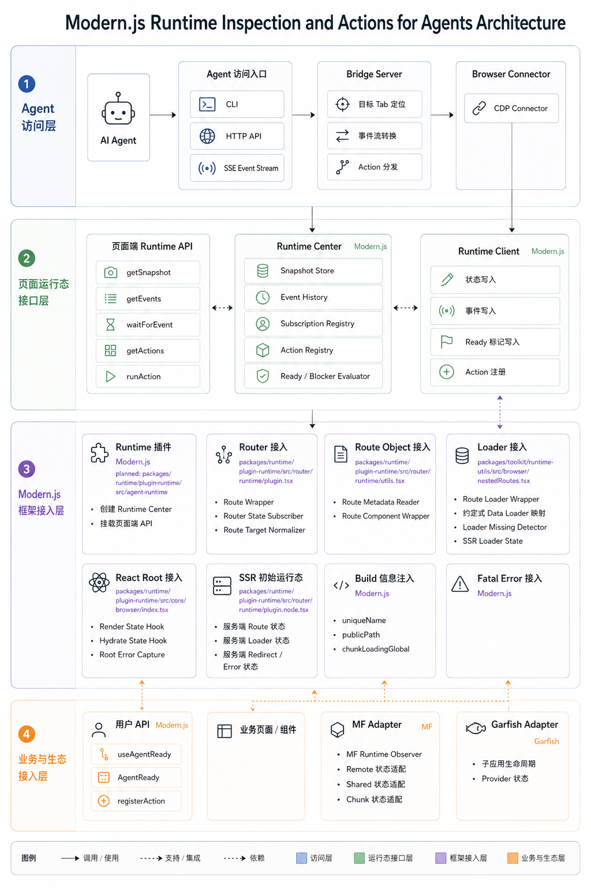

# RFC: Support Runtime Inspection and Actions for Agents in Modern.js

## 状态

Draft

## 摘要

本文定义一套 Modern.js 面向 AI Agent 的运行态观测和受控操作能力。它相当于给 Agent 提供观察页面的“眼”和执行动作的“手”，帮助 Agent 在开发、调试和 oncall 场景中更快理解页面状态、定位阻塞原因，并执行页面声明过的安全动作。

核心思路：

- 框架自动采集 route、loader、渲染、MF、Garfish、错误等运行态信息。
- 业务用轻量标注补充框架无法自动判断的 ready 条件和安全动作。
- 这些信息统一进入页面内运行态中心，并对外提供 snapshot、events 和 actions。
- Agent 通过这套接口读取状态、订阅事件、执行声明过的动作。
- 页面 runtime 只负责采集和维护状态，不在浏览器页面里启动 server。
- HTTP / SSE / CLI 由外部 Node Bridge Server 提供。

目标是把 Agent 过去依赖 UI、DOM、请求是否安静这类脆弱判断，改成可读取、可订阅、可验证、可操作的结构化能力。

## 背景

AI Agent 在开发、调试和 oncall Modern.js 应用时，通常需要先判断页面是否可用，以及不可用时卡在哪一层。当前主要依赖页面外部信号：

| 判断方式 | 能看到什么 |
| --- | --- |
| 看页面 UI | 页面是否白屏、是否出现 loading、内容是否符合预期 |
| 查 DOM | 某个关键元素是否出现 |
| 等请求安静 | 网络请求是否停止 |
| 看 console | 页面是否有运行时报错 |
| 手动点击页面 | 某个流程是否能继续走下去 |

这些方式能提供线索，但在真实开发和 oncall 场景里有明显限制：

| 限制 | 影响 |
| --- | --- |
| 只能看到外部结果 | Agent 容易知道“页面不对”，但不知道卡在 route、loader、MF、Garfish、React 渲染还是业务 ready |
| 判断质量不稳定 | DOM 出现不代表业务可用，请求停止不代表页面 ready，console 报错也不一定是根因 |
| 定位速度慢 | Agent 需要反复等待、观察、扫 DOM、看日志和试点击 |
| 操作不可靠 | Agent 不知道哪些动作安全，也不知道执行后应该等待什么状态 |

同样是“页面没按预期工作”，外部现象可能很像，但实际问题分布在不同运行层：

| 场景 | 外部现象 | 实际需要判断的运行态 |
| --- | --- | --- |
| React 依赖或实例异常 | 页面报错或组件不可用 | shared 依赖来源、React 实例、组件错误 |
| 嵌套路由或远程组件关系异常 | 页面局部异常或远程组件关系不清 | route match、组件关系、渲染错误 |
| 异步 chunk 或运行时隔离异常 | 点击后 chunk 404 或子应用异常 | build 信息、remote 事件、Garfish 事件、chunk 错误 |
| Garfish 子应用白屏 | 子应用白屏或挂载失败 | entry 是否加载、provider 是否存在、mount 是否成功 |
| redirect / loader 卡住 | 页面一直 pending 或跳转不完整 | loader 是否执行、redirect 是否发生、route 是否卡住 |
| 程序化跳转后空白 | 跳转后空白 | route 是否匹配、basename 是否正确、action 是否执行 |

因此希望在 Modern.js 中提供一套面向 AI Agent 的运行态观测和受控操作能力：通过 snapshot 读取页面当前状态，通过 events 订阅运行过程，通过 ready / blockers 判断页面是否可用和卡在哪，通过 actions 执行页面声明过的安全动作。

最终让 Agent 从“观察外部现象并猜测”，变成“读取结构化运行态并按声明能力操作”，提升开发、调试和 oncall 的质量和速度。

## 目标

本 RFC 目标是在 Modern.js 中定义一套面向 AI Agent 的页面运行态能力，包含：

- 提供页面当前状态快照，覆盖 route、loader、React 渲染、MF、Garfish、错误和用户 ready 标注。
- 提供运行时事件流，让 Agent 可以订阅 route、loader、组件 ready、remote 加载、子应用挂载等状态变化。
- 提供页面 ready 判断，返回当前是否可用、已满足的证据和未完成的 blockers。
- 提供受控 actions，让 Agent 只能执行框架或业务声明过的安全动作。
- 提供统一访问方式，支持页面内 API、CLI、HTTP API 和事件流。
- 明确框架自动采集和业务手动标注的边界。

## 使用示例

### 获取页面当前快照

Agent 打开页面后，先通过 CLI 或 HTTP API 读取目标页面的 snapshot，判断页面卡在哪一层。

```bash
agent-runtime snapshot --target http://localhost:4332
```

或：

```http
GET /snapshot
```

返回信息包含：

- 当前 URL、route match 和 navigation 状态；
- app root 是否 mounted；
- 当前 route loader 是否完成；
- 当前页面依赖的 remote / expose / shared 是否成功，视项目类型而定；
- Garfish 子应用是否 mounted，视项目类型而定；
- 当前 fatal error 和最近 runtime error；
- 当前页面声明过哪些 actions。

这类能力用于 oncall 排障时，先回答“页面现在是什么状态”，而不是直接猜。

### 等待页面 ready

Agent 可以等待页面达到指定 ready level。

```bash
agent-runtime wait page.ready --target route:/trade/order --timeout 10000
```

或：

```http
POST /wait
Content-Type: application/json

{
  "type": "page.ready",
  "target": "route:/trade/order",
  "timeout": 10000
}
```

如果超时，返回当前 blockers：

```json
{
  "ready": false,
  "phase": "blocked",
  "blockers": [
    "remote expose failed: provider/Button",
    "component not ready: order-form"
  ]
}
```

这类能力用于区分：

- 路由没匹配；
- loader 没完成；
- remote 没加载成功；
- 组件已经 mounted，但业务 ready 没触发。

### 精准等待业务组件加载完成

如果业务已经在代码里声明了某个组件的加载完成条件，Agent 就可以在页面加载前开始等待这个信号，并精准捕获组件真正可用的时机。

例如，业务组件声明 `user-profile` 什么时候算加载完成：

```tsx
useAgentReady('user-profile', !loading && Boolean(data));
```

这里的 `useAgentReady` 由业务组件调用，不是 Agent 调用，也不是 runtime 主动执行。第二个参数是业务自己定义的完成条件。

Agent 等待这个信号：

```bash
agent-runtime events --type component.ready --target component:user-profile
```

或：

```http
GET /events/stream?type=component.ready&target=component:user-profile
```

当 `loading` 结束且 `data` 有值时，runtime 记录 `user-profile` 已完成，并发出 `component.ready` 事件。Agent 会立即收到事件，不需要反复轮询 DOM。

### 执行页面声明过的动作

页面或框架可以声明安全动作，例如加载 remote、进入某个路由、重试失败请求。

```bash
agent-runtime actions
agent-runtime action load-provider-remote
```

或：

```http
GET /actions
POST /actions/load-provider-remote
```

event 只能观察，action 才能执行。Agent 不能通过订阅事件来触发页面行为。

### 调试需要登录态的页面

调试需要登录态的页面时，可以让 CLI 连接已有浏览器 tab，复用当前登录状态。

```bash
agent-runtime snapshot --target http://localhost:4332
agent-runtime wait page.ready --timeout 10000
agent-runtime events --since 42
agent-runtime action load-provider-remote
```

典型流程：

1. 读取 snapshot，确认当前页面是否 ready；
2. 如果不 ready，查看 blockers；
3. 订阅后续 events；
4. 只执行页面声明过的 actions；
5. 把 snapshot 和 events 作为调试结论证据。

## 术语

### Runtime Center

页面内的状态聚合模块，负责维护当前 snapshot、历史 events、订阅关系和 actions。它是内部实现，不是独立服务，也不是对外产品名。

### Runtime Client

页面端 API。框架插件、MF、Garfish 和业务代码通过它写入运行态信息、声明 ready 条件、注册 actions。

### Bridge Server

运行在页面外的本地服务，对 Agent 暴露 CLI / HTTP / SSE 能力，并通过浏览器连接访问目标页面的 Runtime Center。

### Browser Connector

Bridge Server 和浏览器 tab 之间的连接层。第一阶段推荐使用 CDP。

### Snapshot

页面当前运行态快照，用来回答“页面现在是什么状态”。

### Event

运行过程中已经发生的事实，例如 `route.started`、`loader.success`、`component.ready`。Event 只用于观察，不能触发页面行为。

### Action

页面或框架声明过的可执行动作，例如 `load-provider-remote`、`enter-default-page`。Agent 只能执行已声明的 actions。

### Ready

页面、路由、组件或子应用达到可用状态的信号。框架可以判断基础 ready，业务 ready 需要用户显式声明。

### Blocker

导致页面暂时不可用或无法判断 ready 的阻塞原因，例如 loader 未完成、remote 加载失败、组件 ready 未触发。

## 架构图



图中需要注意几个边界：

- 页面内 Runtime Center 只负责维护 snapshot、events、actions 和 blockers，不在浏览器页面里启动 HTTP server。
- Modern.js 框架、MF、Garfish 和业务标注都通过 Runtime Client 写入 Runtime Center。
- Agent 通过 CLI / HTTP / SSE 访问能力；这些入口由页面外的 Bridge Server 提供。
- Bridge Server 通过 Browser Connector 连接目标浏览器 tab，再访问页面内 Runtime API。
- snapshot / events 是观测路径，从页面返回给 Agent；actions 是执行路径，只能触发页面声明过的动作。

## 实现方案

实现方案按模块拆分。各模块通过统一的数据结构和 API 协作，Runtime Center 负责页面内状态聚合，Modern.js、MF、Garfish 和业务代码负责写入运行态信息，Agent 访问层负责从页面外读取和操作这些能力。

| 模块 | 主要产出 | 主要依赖 | 并行关系 |
| --- | --- | --- | --- |
| 1. 数据结构和 API | 统一的数据结构和页面端 API | 无 | 需要优先稳定 |
| 2. Runtime Center | 页面内状态中心 | 数据结构和 API | 可独立开发 |
| 3. Modern.js 运行链路改造 | 框架自动写入运行态 | Runtime Client | 可和 Agent 访问层并行 |
| 4. 生态能力接入 | MF / Garfish 状态写入 | Runtime Client、事件 schema | 可由生态 owner 并行开发 |
| 5. 业务拓展 API | 业务 ready 和 actions 声明方式 | Runtime Client、Action schema | 可和框架改造并行 |
| 6. Agent 访问层 | Bridge Server、CLI、HTTP / SSE | 页面端 Runtime API | 可先用 mock Runtime API 开发 |
| 7. Page Ready 组合规则 | ready / evidence / blockers | Runtime Center 和各类事件 | 依赖前面状态输入 |
| 8. 安全和验证 | 权限、脱敏、demo 和测试 | 全部模块 | 贯穿开发，最后收敛验收 |

### 1. 数据结构和 API

这一节定义所有模块共同使用的数据结构和 API，包括 snapshot、events、actions、ready、blockers、Runtime Client 和页面端 Runtime API。

三类核心对象的职责如下：

| 对象 | 使用方 | 作用 |
| --- | --- | --- |
| `RuntimeClient` | Modern.js、MF Adapter、Garfish Adapter、业务拓展 API | 写入运行态信息，例如 route、loader、remote、ready、action |
| `RuntimeCenter` | 页面内 runtime | 存储 snapshot、events、actions，并计算 ready / blockers |
| `AgentRuntime` | Bridge Server、CLI、DevTools、Agent | 读取 snapshot、订阅 events、等待 ready、执行已声明 actions |

`RuntimeClient` 和 `AgentRuntime` 都是 `RuntimeCenter` 暴露出的不同入口：前者用于写入，后者用于读取和受控操作。

对框架用户而言，主要使用的是业务拓展 API，例如 `useAgentReady`、`AgentReady`、`registerAction`。`RuntimeClient`、`RuntimeCenter` 和 `AgentRuntime` 是框架、adapter 和 Agent 访问层的内部协作对象，不建议业务代码直接使用。

#### 页面端 Runtime API

页面内 runtime 暴露给 Bridge Server / DevTools / 调试脚本使用的 API：

```ts
type AgentRuntime = {
  getSnapshot(filter?: SnapshotFilter): Promise<RuntimeSnapshot>;
  getEvents(filter?: EventFilter): Promise<RuntimeEvent[]>;
  subscribeEvents(
    filter: EventFilter,
    listener: (event: RuntimeEvent) => void,
  ): () => void;
  waitForEvent(
    filter: EventFilter,
    options?: WaitOptions,
  ): Promise<RuntimeEvent | ReadyResult>;
  getActions(filter?: ActionFilter): Promise<ActionDescriptor[]>;
  runAction(actionId: string, payload?: unknown): Promise<ActionResult>;
};
```

Agent 正常不直接在业务代码里调用这个对象，而是通过 CLI / HTTP / SSE 访问。Bridge Server 再进入目标浏览器 tab，调用页面端 Runtime API。

这里的 `AgentRuntime` 是 Runtime Center 暴露给页面外部工具使用的 API 形态，不是 Runtime Center 本身。

#### Runtime Client API

Runtime Client 是框架、生态 adapter 和业务代码写入 Runtime Center 的页面端 API。它至少需要支持：

- 写入 snapshot 局部状态；
- 发出 runtime event；
- 注册或更新 ready marker；
- 注册 actions；
- 写入 error、evidence 和 blockers。

原则是：先更新 snapshot，再发 event。这样 Agent 收到 event 后，马上能读到最新状态。

```ts
type RuntimeClient = {
  updateState(patch: RuntimeStatePatch): void;
  emit(event: RuntimeEventInput): RuntimeEvent;
  markReady(target: string, ready: boolean, details?: unknown): void;
  registerAction(action: ActionDescriptor, handler: ActionHandler): void;
  reportError(error: RuntimeError): void;
};
```

#### RuntimeCenter

`RuntimeCenter` 是页面内的内部对象。它通过 `client` 接收框架和业务写入，通过 `api` 暴露给 Bridge Server。

```ts
type RuntimeCenter = {
  api: AgentRuntime;
  client: RuntimeClient;

  getSnapshot(filter?: SnapshotFilter): RuntimeSnapshot;
  appendEvent(event: RuntimeEventInput): RuntimeEvent;
  updateState(patch: RuntimeStatePatch): void;
  registerAction(action: ActionDescriptor, handler: ActionHandler): void;
  runAction(actionId: string, payload?: unknown): Promise<ActionResult>;
  subscribeEvents(
    filter: EventFilter,
    listener: (event: RuntimeEvent) => void,
  ): () => void;
  waitForEvent(
    filter: EventFilter,
    options?: WaitOptions,
  ): Promise<RuntimeEvent | ReadyResult>;
};
```

#### Snapshot

```ts
type RuntimeSnapshot = {
  page: PageState;
  route?: RouteState;
  loaders?: LoaderState[];
  components?: ComponentState[];
  remotes?: RemoteState[];
  shared?: SharedState[];
  garfish?: GarfishState;
  build?: BuildRuntimeInfo;
  actions?: ActionDescriptor[];
  errors?: RuntimeError[];
};
```

#### Event

```ts
type RuntimeEvent = {
  id: string;
  type: string;
  target?: string;
  phase?: string;
  source: 'framework' | 'user' | 'agent' | 'bridge';
  timestamp: number;
  route?: string;
  evidence?: string[];
  details?: unknown;
  error?: RuntimeError;
};
```

Event 只表示“发生了什么”，不能触发页面行为。

#### Action

```ts
type ActionDescriptor = {
  id: string;
  label: string;
  kind: 'navigation' | 'click' | 'input' | 'retry' | 'custom';
  enabled: boolean;
  reason?: string | null;
  payloadSchema?: unknown;
  risk?: 'safe' | 'state-changing' | 'destructive' | 'sensitive';
};
```

Action 才表示“可以执行什么”。Agent 只能执行页面或框架声明过的 actions。

#### Ready Result

```ts
type PageReadyLevel = 'document' | 'framework' | 'view' | 'business';

type ReadyResult = {
  ready: boolean;
  level: PageReadyLevel;
  phase: 'pending' | 'success' | 'error' | 'blocked' | 'unknown';
  evidence: string[];
  blockers: string[];
};
```

### 2. Runtime Center

Runtime Center 是 `RuntimeCenter` 类型对应的页面内实现，负责维护 snapshot、events、actions、ready 和 blockers。它不包含 Bridge Server、CLI 或 HTTP API，也不在浏览器页面里启动 server。

#### 需要实现的能力

- Snapshot Store：维护页面当前状态，支持局部更新和按 filter 读取。
- Event History：保存最近发生的事件，事件需要递增 id，支持 `since` 增量读取。
- Subscription Registry：管理事件订阅，支持已经发生和未来发生的事件。
- Action Registry：保存页面声明过的 actions，并根据 `enabled`、`risk`、`payloadSchema` 执行校验。
- Ready / Blocker Evaluator：根据 snapshot 和 events 计算 ready、evidence 和 blockers。
- Public API Adapter：把内部能力暴露成 `AgentRuntime` API。
- Client API Adapter：把框架、生态 adapter、业务 API 的写入请求统一转成 state update 和 event。

#### 初始化

框架插件在应用入口创建 Runtime Center，并挂载页面端 API：

```ts
const runtimeCenter = createRuntimeCenter({
  appName,
  framework: 'modern-js',
  build,
});

window.__MODERN_AGENT_RUNTIME__ = runtimeCenter.api;
```

#### 客户端存储位置

客户端 Runtime Center 应该创建在 Modern.js runtime 初始化阶段，并挂到两个位置：

- Modern.js 内部 runtime context：给框架插件、router、loader、React root、MF / Garfish adapter 使用。
- 受控的 window 全局入口：给 Bridge Server 通过浏览器连接读取。

示例：

```ts
const runtimeCenter = createRuntimeCenter({
  appName,
  framework: 'modern-js',
  build,
});

internalRuntimeContext.agentRuntime = runtimeCenter;
window.__MODERN_AGENT_RUNTIME__ = runtimeCenter.api;
```

这里 `internalRuntimeContext.agentRuntime` 给框架内部写入，`window.__MODERN_AGENT_RUNTIME__` 给页面外部工具读取。window 上只暴露 `AgentRuntime`，不暴露完整 `RuntimeCenter`。

不建议：

- 放在 React state 里，因为 route、loader、MF、Garfish 不一定都在 React 生命周期里；
- 只放在 `window` 上，因为框架内部写入会变得松散，也不好测试；
- 每个插件各自维护一份 store，因为状态无法统一组合 ready / blockers。

#### SSR 初始状态

SSR 场景需要使用 request-scoped runtime store，不能使用服务端全局 singleton。

每个 request 创建一份临时 runtime store，用来记录：

- 服务端 matched routes；
- 服务端 loader started / success / redirect / error；
- 初始 loaderData；
- 初始 route error；
- 是否发生 SSR 降级。

SSR 完成后，把服务端收集到的初始 runtime data 序列化到 HTML：

```html
<script>
  window.__MODERN_AGENT_RUNTIME_DATA__ = {};
</script>
```

客户端初始化 Runtime Center 时读取这份数据：

```ts
const runtimeCenter = createRuntimeCenter({
  initialSnapshot: window.__MODERN_AGENT_RUNTIME_DATA__,
});
```

之后客户端继续接管 route、loader、render、MF、Garfish 等后续事件。

关键边界：

- 服务端不能用全局 Runtime Center，避免串请求；
- 客户端只有一个页面级 Runtime Center；
- SSR 只下发初始 snapshot / events，不启动 Bridge Server；
- Bridge Server 仍然是页面外部进程。

#### 事件历史和订阅

Runtime Center 需要同时支持已经发生和未来发生的事件：

1. 先读当前 snapshot；
2. 如果目标已经满足，立即返回；
3. 如果还没满足，再进入订阅等待；
4. 超时后返回当前 blockers。

事件历史要求：

- 每个 event 有递增 `eventId`；
- 支持按 `since` 增量读取；
- 保留一个有上限的 ring buffer；
- snapshot 里记录当前最新 `eventId`；
- event history 不应该无限增长。

#### Action registry

Runtime Center 只执行已注册 actions。action 需要携带 `enabled`、`risk`、`payloadSchema` 等信息，方便 Agent 判断是否能执行，以及执行时需要传什么参数。

#### 开发边界

- Runtime Center 只运行在浏览器页面内。
- Runtime Center 不启动 HTTP server。
- Runtime Center 不直接连接浏览器调试协议。
- Runtime Center 不主动扫描 DOM 或 React fiber tree。
- Runtime Center 不执行未注册的 action。
- Runtime Center 不猜业务 ready，只消费业务通过 API 声明的 ready 条件。

#### 完成标准

- `getSnapshot()` 能返回当前完整页面状态。
- `getEvents({ since })` 能返回指定 id 之后的事件。
- `waitForEvent()` 对已经发生和未来发生的事件都能正确返回。
- action 只有注册后才能被 `runAction()` 执行。
- ready 超时能返回 blockers，而不是只返回 timeout。

### 3. Modern.js 运行链路改造

这一节负责改造 Modern.js 已有运行链路，把框架能够确定的 route、loader、render、SSR、build 和错误状态写入 Runtime Center。这些能力由框架自动提供，不要求业务在每个页面手动声明。

#### Router

router 接入应该基于当前框架路由，不另起一套路由监听，也不通过 DOM click 或 `useNavigate` monkey patch 来猜测跳转。

以 Modern.js 当前路由为例，框架已经在 runtime router 插件中完成：

1. 生成或读取 route objects。
2. 执行 `modifyRoutes`。
3. 创建 `createBrowserRouter` 或 `createHashRouter`。
4. 通过 `RouterProvider` 渲染。

接入点分成两类。

创建 router 前，递归包装 `modifiedRoutes`：

- 如果 route 已经有 loader，包装这个已有 loader，记录 `loader.started`、`loader.success`、`loader.redirect`、`loader.error`；
- 包装 route component，记录 `component.mounted`、`component.unmounted`、`component.error`；
- 保留原始 route 行为，不改变用户代码返回值；
- 保留 route id、path、handle、hasLoader 等元信息，用于生成稳定 target；
- 如果 route 没有 loader，不创建新的 loader，只记录 route metadata。

创建 router 后，订阅 router state：

- 当前 location；
- 当前 navigation state；
- 当前 matches；
- 当前 route errors；
- 当前 loaderData；
- basename 是否匹配；
- navigation 从 loading 回到 idle 后，框架层 route 是否 ready。

建议 route 事件：

| 框架生命周期 | Runtime event | Snapshot 更新 |
| --- | --- | --- |
| 开始跳转 | `route.started` | `route.phase = 'started'` |
| 路由匹配完成 | `route.matched` | `route.matched = true` |
| 路由不匹配 | `route.unmatched` | `route.matched = false` |
| 路由错误 | `route.error` | `route.phase = 'error'` |
| 路由页面 mounted | `route.ready` | `route.phase = 'success'` |

`route.ready` 只代表框架层 ready，不代表业务 ready。业务成功条件仍然由业务拓展 API 显式声明。

#### Loader

Modern.js 约定式路由里的 `page.loader.ts`、`layout.loader.ts`、`page.data.ts`、`layout.data.ts` 都归到同一类能力：route data loader。

| 约定文件 | Runtime kind | 说明 |
| --- | --- | --- |
| `page.loader.ts` | `route-loader` | 页面 route loader |
| `layout.loader.ts` | `route-loader` | layout route loader |
| `page.data.ts` | `route-loader` | 页面约定式 data loader |
| `layout.data.ts` | `route-loader` | layout 约定式 data loader |
| `page.data.client.ts` | `route-loader` | 页面 client data loader |
| `layout.data.client.ts` | `route-loader` | layout client data loader |

单个 route object 通常最多对应一个 route data loader，但一次 navigation 会命中多个 routes，所以一次页面跳转可能有多个 loader 同时参与。

建议 loader 事件：

| 状态 | Runtime event |
| --- | --- |
| 开始执行 | `loader.started` |
| 成功返回 | `loader.success` |
| 返回 redirect | `loader.redirect` |
| 仍在等待 | `loader.pending` |
| 执行失败 | `loader.error` |
| 执行被取消 | `loader.aborted` |
| deferred 数据返回 | `loader.deferred` |
| 预期应执行但未执行 | `loader.missing` |

实现边界：

- 只包装已有 loader / data，不自动创建业务 loader；
- 原 loader 返回什么、抛什么、redirect 什么，都必须原样保留；
- `loader.redirect` 不能当作 `loader.error`；
- `page.data.client.ts` 这类 client loader 要和 server loader 用同一个 `routeId` 关联，但用 `execution` 区分；
- `loader.missing` 只是诊断信号，不会补执行 loader。

`loader.missing` 用于判断“框架知道这里应该有 loader，但它没有执行”。例如当前 matched route 标记了 `hasLoader`，但 event history 里没有对应 `loader.started`，snapshot 里也没有对应 loaderData，并且 navigation 已经不在 loading。

#### React root 和 route component

React 层不以复刻完整 React tree 为目标。第一阶段只记录框架能够稳定确认的生命周期，以及业务显式声明的 ready marker。后续如果需要组件级诊断，应作为独立增强能力评估，而不是默认纳入本 RFC 范围。

范围分成三类：

1. React root 生命周期；
2. route component 生命周期；
3. 用户声明的 ready marker。

默认不包含：

- 遍历完整 React fiber tree；
- 输出页面所有组件列表；
- 自动判断任意业务组件是否 ready；
- monkey patch 所有 hooks；
- 自动识别 `Loading` / `UserProfile` 谁代表成功态。

建议 React root 事件：

| 状态 | Runtime event |
| --- | --- |
| root 开始 render | `react.root.render.started` |
| root mounted | `react.root.mounted` |
| hydrate 开始 | `react.root.hydrate.started` |
| hydrate 成功 | `react.root.hydrate.success` |
| hydrate 失败或降级 CSR | `react.root.hydrate.fallback-client-render` |
| root 级错误 | `react.root.error` |

route component 生命周期来自 router 包装，不来自全量 React tree 扫描。建议事件包括 `component.mounted`、`component.unmounted`、`component.pending`、`component.resolved`、`component.error`。

#### SSR 初始状态

SSR 场景需要补充服务端侧状态。如果 loader / redirect 在服务端执行，只在客户端订阅 router state 会丢失服务端过程。因此 SSR 应该把这些信息写进初始 runtime 数据，随 HTML 一起下发：

- 服务端 matched routes；
- 服务端 loader started / success / redirect / error；
- 初始 loaderData；
- 初始 route error；
- 是否发生 SSR 降级。

客户端 Runtime Center 初始化时合并这份初始状态，再继续监听后续客户端路由变化。

#### Build 信息和 fatal error

构建插件应在产物中注入可读的运行信息：

```ts
runtimeCenter.updateState({
  build: {
    uniqueName,
    chunkLoadingGlobal,
    publicPath,
    runtimeChunk,
    entryUrl,
  },
});
```

这些信息用于 async chunk 404、`undefined.js`、多套产物 runtime 冲突等问题。

Runtime Client 还需要记录影响页面 ready 的 fatal browser error，例如 root render error、资源加载失败、不可恢复的 runtime error。

### 4. 生态能力接入

生态能力接入负责把 Modern.js 之外的运行态来源写入 Runtime Center。第一阶段主要包括 MF 和 Garfish。

#### MF Adapter

MF 侧应该提供通用的运行态观测能力。它不应该直接依赖 Modern.js、React、Garfish 或具体 Agent。

Runtime Center 只消费这些通用信息，并把它们和框架 route、loader、React mounted、业务 ready marker 组合起来判断页面状态。

MF 侧建议提供稳定 API：

```ts
type MFRuntimeObserver = {
  getMFSnapshot(): MFSnapshot;
  getMFEvents(filter?: MFEventFilter): MFEvent[];
  subscribeMFEvents(
    filter: MFEventFilter,
    listener: (event: MFEvent) => void,
  ): () => void;
};
```

最小闭环：

- `getMFSnapshot()`：拿当前 MF 状态；
- `getMFEvents({ since })`：补齐历史事件；
- `subscribeMFEvents()`：订阅后续事件；
- 稳定 event schema：保证不同工具可以消费同一套数据。

MF snapshot 至少需要包含：runtime instance、remote、manifest、entry、expose、shared 解析结果、最近错误、重试、fallback、timeout，以及 manifest / stats 中能帮助定位问题的信息。

建议事件：

| 状态 | MF event | Runtime Center event |
| --- | --- | --- |
| manifest 开始加载 | `mf.manifest.started` | `remote.manifest.started` |
| manifest 成功 | `mf.manifest.success` | `remote.manifest.success` |
| manifest 失败 | `mf.manifest.error` | `remote.error` |
| remote entry 开始加载 | `mf.entry.started` | `remote.entry.started` |
| remote entry 成功 | `mf.entry.success` | `remote.entry.success` |
| remote entry 失败 | `mf.entry.error` | `remote.error` |
| expose 开始加载 | `mf.expose.started` | `remote.expose.started` |
| expose 成功 | `mf.expose.success` | `remote.expose.success` |
| expose 失败 | `mf.expose.error` | `remote.error` |
| shared 依赖解析成功 | `mf.shared.resolve.success` | `shared.resolve.success` |
| shared 依赖解析失败 | `mf.shared.resolve.error` | `shared.resolve.error` |
| chunk 加载失败 | `mf.chunk.error` | `remote.error` |

MF 错误结构需要稳定区分 manifest 拉取失败、entry 拉取失败、container 初始化失败、expose 不存在、shared 版本不匹配、singleton 冲突、chunk 加载失败、timeout、fallback 生效等类型。

当前 Observability Plugin 可以作为第一阶段数据来源。Runtime Center 可以通过 MF adapter 消费它已有的 report / trace 信息，再标准化成 Runtime Center 事件。长期看，MF 侧应该沉淀稳定的 runtime observer API，而不是让框架或 Agent 依赖插件内部实现、页面全局变量或特定 DevTools 面板的数据格式。

MF 侧只负责判断 MF 加载链路，不负责判断 React 组件是否 mounted、remote 组件业务是否 ready、Garfish 子应用是否 mounted 或页面是否最终可用。

#### Garfish Adapter

Garfish 层应把子应用生命周期写入 Runtime Center。

| 状态 | Runtime event |
| --- | --- |
| 子应用注册 | `garfish.app.registered` |
| 入口开始加载 | `garfish.entry.started` |
| 入口加载成功 | `garfish.entry.success` |
| provider 找到 | `garfish.provider.ready` |
| provider 缺失 | `garfish.provider.missing` |
| 子应用 mounted | `garfish.app.mounted` |
| 子应用 ready | `garfish.app.ready` |
| 子应用失败 | `garfish.app.error` |

`garfish.app.mounted` 可以自动判断，`garfish.app.ready` 可以由子应用业务标注触发。

### 5. 业务拓展 API

业务拓展 API 用来补充框架无法自动判断的信息。框架可以知道 route、loader、render 等基础状态，但业务成功条件、关键组件完成状态、可执行动作、脱敏规则和可忽略错误需要业务显式提供。

业务可以声明：

- 关键组件 ready；
- 页面业务 ready；
- Agent 可以执行的 actions；
- 需要关注的 route 或 component；
- 可忽略错误；
- 敏感数据脱敏规则。

#### API 获取方式

业务拓展 API 由 Modern.js runtime 包导出，用户不需要手动获取 Runtime Center 或 Runtime Client。

```ts
import {
  AgentReady,
  registerAction,
  useAgentReady,
} from '@modern-js/runtime/agent';
```

这些 API 内部通过 Modern.js runtime context 获取 Runtime Client，并写入 Runtime Center。

业务代码不应该直接访问 `window.__MODERN_AGENT_RUNTIME__`，也不应该直接调用 `RuntimeClient`。

示例：

```tsx
function UserProfile() {
  const { data, loading } = useUser();

  useAgentReady('user-profile', !loading && Boolean(data));

  if (loading) {
    return <Loading />;
  }

  return <Profile data={data} />;
}
```

这里的 `useAgentReady` 由业务组件调用，不是 Agent 调用，也不是 runtime 主动执行。第二个参数是业务自己定义的完成条件。

边界：

- 业务自己用 SWR、React Query、fetch 等发出的请求不属于 route data loader；
- 业务请求如果要参与 Agent 判断，应通过业务拓展 API 或后续 data dependency 标注进入 Runtime Center；
- Action 必须由页面或框架声明，Agent 不能通过 event 订阅触发页面行为。

### 6. Agent 访问层

Agent 访问层负责让 Agent 从页面外访问页面内 Runtime Center。它包括 Bridge Server、Browser Connector、HTTP API、SSE / long polling 和 CLI。

第一阶段页面 runtime 不主动连接 Bridge Server。Bridge Server 通过 Browser Connector 进入目标浏览器 tab，并调用页面上的 `AgentRuntime` API。页面 runtime 只维护状态和暴露 API，不感知 Bridge Server 的端口，也不负责重连。

连接路径：

```txt
Bridge Server
  -> Browser Connector / CDP
  -> 目标浏览器 tab
  -> window.__MODERN_AGENT_RUNTIME__
  -> AgentRuntime API
  -> Runtime Center
```

#### Bridge Server 协议

第一阶段推荐：

```txt
HTTP API + SSE events + long polling fallback
```

推荐端点：

```txt
GET  /snapshot
GET  /events?since=<eventId>
GET  /events/stream
GET  /actions
POST /actions/:id
POST /wait
GET  /health
```

动作必须通过 action 端点触发，不能通过 event 订阅触发。

#### Bridge Server 启动位置

Bridge Server 是页面外部的本地 Node 进程，不运行在浏览器页面内。

第一阶段不建议由 Modern.js dev server 默认自动启动。推荐通过显式开关启用：

```bash
modern dev --agent-runtime
```

或：

```ts
export default defineConfig({
  dev: {
    agentRuntime: true,
  },
});
```

启用后，dev server 会额外启动本地 Agent Runtime API。例如：

```txt
Modern.js dev server: http://localhost:4332
Agent Runtime API:    http://localhost:7332
```

生产页面默认不启动 Bridge Server。

#### CLI 和 dev server 的关系

CLI 也可以按需启动临时 Bridge Server。CLI 启动前应先探测当前项目是否已有 Bridge Server：

- 如果已有 Bridge Server，优先复用；
- 如果没有，CLI 启动临时 Bridge Server；
- 如果端口被占用但不是 Bridge Server，换端口或提示用户；
- 如果已有 Bridge Server 绑定同一个目标 tab，复用已有绑定；
- 如果已有 Bridge Server 绑定不同目标 tab，要求用户指定 target 或 session；
- 如果用户显式传 `--port`，使用指定端口；
- 如果用户显式传 `--new-session`，创建新会话，但不能抢占已有 tab 绑定。

```txt
CLI
  -> detect existing Bridge Server
  -> found: reuse
  -> not found: start local temporary Bridge Server
```

#### CLI

CLI 是 Bridge Server 的薄封装。

```bash
agent-runtime open http://localhost:4332
agent-runtime snapshot
agent-runtime wait page.ready --timeout 10000
agent-runtime wait component.ready --target component:user-profile
agent-runtime actions
agent-runtime action load-provider-remote
agent-runtime events --since 42
```

CLI 支持两种浏览器模式：

| 模式 | 场景 |
| --- | --- |
| 启动隔离浏览器 | 本地 demo，不依赖登录态 |
| 连接已有浏览器 | 需要复用当前登录状态的页面 |

#### 连接页面 Runtime

CLI 不是直接请求业务页面，也不是等待页面 runtime 主动连接，而是通过浏览器调试通道进入目标 tab。

```txt
CLI
  -> CDP
  -> 目标浏览器 tab
  -> window.__MODERN_AGENT_RUNTIME__
  -> Runtime Center
```

事件流第一版可以用事件历史增量拉取：

1. 页面 runtime 维护带递增 id 的 event history；
2. Bridge Server 通过 CDP 调 `getEvents({ since })`；
3. Bridge Server 把新增 events 转成 SSE；
4. long polling 复用同一套 event history。

这样第一版不需要处理跨进程 callback。

#### Server 生命周期和传输协议

HTTP / SSE server 在浏览器页面外部运行。CLI 模式下，CLI 启动或复用本地 Bridge Server，打开或连接浏览器，并绑定目标 tab。

| 协议 | 第一阶段建议 | 原因 |
| --- | --- | --- |
| HTTP | 用于 snapshot 和 action | 简单、好调试 |
| SSE | 用于 event stream | 适合服务端持续推事件给 Agent |
| Long polling | 兜底 | 流式连接不可用时仍能工作 |
| WebSocket | 暂不默认 | 双向能力强，但连接管理和调试成本更高 |

只有在需要高频双向通信、页面主动向 Agent 请求能力、或未来做复杂远程调试时，才需要把 WebSocket 作为 adapter 加进来。

### 7. Page Ready 组合规则

Page Ready 组合规则负责把 route、loader、React、MF、Garfish、业务 ready 等信息组合成最终页面状态，输出 ready、level、phase、evidence 和 blockers。

推荐层级：

| Level | 含义 | 来源 |
| --- | --- | --- |
| `document` | HTML document 已加载 | 浏览器 |
| `framework` | route 命中、loader 完成、无框架级 fatal error | 框架 |
| `view` | app root、route component、remote 或 Garfish app 已挂载 | 框架 + runtime |
| `business` | 页面业务成功条件达成 | 业务拓展 API |

默认 ready 判断：

1. document 已加载；
2. 当前 route 命中；
3. loader 没有 pending；
4. 没有 fatal error；
5. app root mounted；
6. 如果当前页面依赖 remote / Garfish，需要对应挂载完成；
7. 如果用户声明了 ready marker，需要 ready marker 触发。

有 loader 的页面：

```txt
route matched
+ loaders settled
+ route component mounted
+ no render error
+ user ready marker if configured
= page ready
```

没有 loader 的页面：

```txt
route matched
+ navigation idle
+ route component mounted
+ no render error
= framework ready
```

请求是否安静可以作为 evidence，但不应该作为必须满足的 ready 条件。

### 8. 安全和验证

#### 安全边界

- Bridge Server 默认只监听 localhost；
- 生产页面默认不启动 server；
- Agent 只能执行声明过的 actions；
- actions 应带 risk 标记；
- snapshot 中敏感字段需要支持脱敏；
- Bridge Server 默认绑定单个目标 tab；
- 连接已有浏览器时，必须由用户明确选择或授权。

#### 自动能力和业务边界

| 能力 | 归属 |
| --- | --- |
| route location / match | Modern.js 运行链路改造 |
| loader lifecycle | Modern.js 运行链路改造 |
| app root mounted | Modern.js 运行链路改造 |
| render error | Modern.js 运行链路改造 |
| remote load state | MF Adapter |
| shared runtime state | MF Adapter |
| build runtime info | Modern.js 运行链路改造 |
| Garfish app lifecycle | Garfish Adapter |
| fatal browser error | Runtime Client |
| business ready | 业务拓展 API |
| safe actions | 业务拓展 API |
| sensitive data masking | 业务拓展 API |
| ignored errors | 业务拓展 API |

#### Demo 验证

| Demo | 主要运行态信号 |
| --- | --- |
| `react-multi-version` | shared state、dependency source、component error |
| `nested-router-tree` | route state、component relation、render error |
| `async-chunk-runtime` | build info、remote event、Garfish event、chunk error |
| `garfish-provider` | entry loaded、provider missing、Garfish mount failed |
| `redirect-loader` | loader not executed、redirect missing、page pending |
| `usenavigate-blank` | route mismatch、basename issue、action result、blank state |

验证时需要确认：

- demo 页面只负责复现真实问题，不混入未来 API 面板；
- 每个 demo 都能通过 snapshot / events / actions 给出结构化证据；
- Page Ready 超时时返回 blockers，而不是只返回 timeout；
- Agent 执行 action 后，可以通过 events 看到后续状态变化。

## 待确认问题

1. action 的 `risk` 标记是否在第一阶段强制校验，还是先作为描述字段返回给 Agent。
2. Garfish 状态由 Garfish 提供稳定 observer API，还是第一阶段先由 Modern.js / Agent Runtime adapter 兼容采集。
3. Bridge Server 第一阶段是否只支持单 tab 绑定，还是支持一个进程管理多个 session / tab。
4. MF 侧 observer API 的字段和事件 schema 是否由 MF 单独 RFC 定义。
5. 业务拓展 API 首期是否只提供 `useAgentReady` 和 `registerAction`，还是同时提供 `AgentReady` 组件。

## 阶段规划

本文档中的“第一阶段”指先把本地开发调试闭环跑通。后续阶段不应该简单理解成继续堆能力，而是逐步把兼容实现、单页面调试、描述性策略沉淀成稳定、通用、可扩展的能力。

| 阶段 | 目标 | 主要范围 | 边界 |
| --- | --- | --- | --- |
| 第一阶段：本地开发调试闭环 | 让 Agent 能在 Modern.js 本地开发和带登录态调试场景中可靠拿到页面状态，并执行声明过的动作 | 数据结构和 API、Runtime Center、Modern.js 路由 / loader / React root / route component 基础状态、业务 ready marker、MF / Garfish 兼容接入、Bridge Server、CLI、HTTP API、SSE、long polling、Browser Connector 单 tab 调试 | 不复刻完整 React tree；不默认使用 WebSocket；不默认启动 Bridge Server；不默认支持多 tab / 多 session；不自动判断任意业务组件是否 ready |
| 第二阶段：稳定生态接入和协作能力 | 把第一阶段的兼容方案做成稳定接口，让多个页面、多个工具和生态运行时可以可靠接入 | MF 稳定 observer API、Garfish 稳定 observer API、多 tab / 多 session 管理、Bridge Server 会话模型、action 风险校验策略、ready blockers 标准化、dev server 显式配置和 CLI 复用策略 | 不把 React DevTools 能力内置为默认能力；不把所有业务状态自动推断为 ready；不默认接入生产环境页面 |
| 第三阶段：深度诊断和自动化 | 在稳定协议之上扩展更强的诊断和自动化调试能力 | 可选 WebSocket adapter、页面主动连接 Bridge Server、组件级诊断增强、Suspense / lazy / error boundary 等更细状态、MCP / DevTools 等外部工具接入、生产环境受控诊断 | 需要单独评估安全、性能和使用边界；不作为本 RFC 第一阶段交付要求 |

阶段验收建议：

- 第一阶段验收以 demo 和本地真实页面调试为主，确认 Agent 能通过 snapshot / events / actions 给出结构化证据。
- 第二阶段验收以生态接口稳定性为主，确认 MF、Garfish、Bridge Server 多会话和 action 策略可以被独立开发和测试。
- 第三阶段验收以可选增强能力为主，确认深度诊断能力不会影响默认开发体验和页面运行成本。
